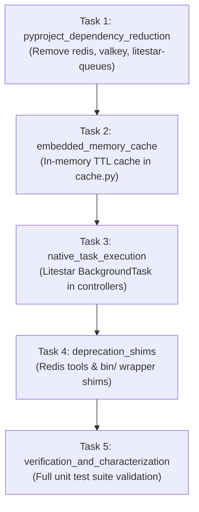

# Flow: Embedded Self-Contained Listener & Native Task Execution

**Flow ID:** `embedded_listener_and_task_execution_20260826`  
**Parent Roadmap:** `modernization_overhaul_20260823`  
**Design Reference:** `docs/internal/design_docs/embedded_listener_and_task_execution_architecture.md`

## 1. Specification & Context

### 1.1 Architectural Rationale
GOE is deployed directly on the Oracle database server or adjacent compute nodes using Oracle RDBMS (`OFFLOAD_REPO`) as the single source of truth. External Redis/Valkey clusters and generic queue packages (`litestar-queues`) introduce unnecessary operational friction.

This flow replaces external broker dependencies with:
1. **Embedded In-Memory TTL Cache**: Lightweight async memory store for endpoint registration and metadata caching.
2. **Native Task Dispatching**: In-process asynchronous task dispatch via Litestar `BackgroundTask` and worker task groups.
3. **Deprecation Shims**: Runtime `DeprecationWarning`s for `goe.util.redis_tools` and legacy `bin/` scripts, scheduled for removal in GOE 2.0.0.
4. **Dependency Reduction**: Removal of `redis`, `valkey`, `hiredis`, `libvalkey`, and `litestar-queues` from `pyproject.toml`.

---

## 2. Implementation Plan

### Tasks
- [ ] `pyproject_dependency_reduction`: Remove `valkey`, `redis`, and `litestar-queues` from `pyproject.toml` and update `uv.lock`.
- [ ] `embedded_memory_cache`: Implement thread-safe `MemoryCache` with TTL expiration in `src/goe/listener/utils/cache.py`.
- [ ] `native_task_execution`: Update `src/goe/listener/jobs.py`, `src/goe/listener/app.py`, and `src/goe/listener/controllers/orchestration.py` using Litestar's native task dispatching.
- [ ] `deprecation_shims`: Add `DeprecationWarning` shims to `goe.util.redis_tools` and `bin/` wrapper scripts.
- [ ] `verification_and_characterization`: Author and run unit tests validating full suite passes with zero external service dependencies.
