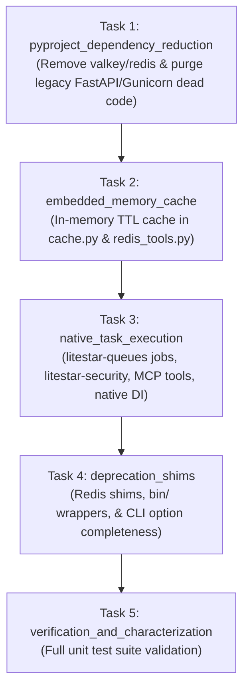

# Flow: Embedded Self-Contained Listener & First-Party Litestar Execution

**Flow ID:** `embedded_listener_and_task_execution_20260826`  
**Parent Roadmap:** `modernization_overhaul_20260823`  
**Design Reference:** `docs/internal/design_docs/embedded_listener_and_task_execution_architecture.md`

## 1. Specification & Context

### 1.1 Architectural Rationale
GOE is deployed directly on the Oracle database server or adjacent compute nodes using Oracle RDBMS (`OFFLOAD_REPO`) as the single source of truth. External Redis/Valkey clusters introduce unnecessary operational friction, while Litestar's first-party ecosystem (`litestar-queues`, `litestar-security`, `litestar-autowire`, `litestar-mcp`, `litestar-granian`) already supports zero-external-broker execution out of the box.

This flow revises and completes the Listener and CLI modernization with:
1. **Dependency Reduction & Dead-Code Purge**: Removal of `valkey[libvalkey]` (`redis`, `hiredis`, `libvalkey`) from `pyproject.toml` and `uv.lock`, while retaining first-party `litestar-queues`, and purging dead legacy FastAPI/Uvicorn/Gunicorn/`goelib_contrib` modules from `src/goe/listener/`.
2. **Embedded In-Memory TTL Cache**: Thread-safe async `MemoryCache` in `src/goe/listener/utils/cache.py` and synchronous `MemorySyncCache` in `src/goe/util/redis_tools.py` for endpoint registration, log buffering, and metadata caching without external Redis daemons.
3. **First-Party `litestar-queues`, `litestar-security`, `litestar-autowire`, & `litestar-mcp` Wiring**:
   - `QueuePlugin(QueueConfig(queue_backend="memory", worker=WorkerConfig(placement="asgi")))` with `AutowireConfig(domain_packages=["goe.listener"], integrations=["queues"])` and real `@task` implementations in `src/goe/listener/jobs.py` calling `periodic_tasks`.
   - `SecurityPlugin` in `src/goe/listener/security.py` enforcing `x-goe-console-key` via `secrets.compare_digest` when `OFFLOAD_LISTENER_SHARED_TOKEN` (`settings.shared_token`) is configured, allowing local unauthenticated access when unset, and keeping `/api/system/status/`, `/docs`, and `/.well-known/*` public.
   - Litestar 2.24 native `NamedDependency`, `FromPath`, `FromQuery`, and `JSONBody` annotations across controllers, plus `mcp_tool=` route exposure for `LitestarMCP`.
4. **Deprecation Shims & CLI Completeness**: Runtime `DeprecationWarning`s for `goe.util.redis_tools`, `goe.listener.utils.cache.RedisClient`, and legacy `bin/` scripts (scheduled for removal in GOE 2.0.0), plus complete `goe offload` option groups, `goe connect --upgrade-environment-file` forwarding, `goe validate --execute` dry-run support, and `goe listener status` / `start`.

---

## 2. Implementation Plan

```mermaid
flowchart TD
    T1["Task 1: pyproject_dependency_reduction\n(Remove valkey/redis & purge legacy FastAPI/Gunicorn dead code)"] --> T2["Task 2: embedded_memory_cache\n(In-memory TTL cache in cache.py & redis_tools.py)"]
    T2 --> T3["Task 3: native_task_execution\n(litestar-queues jobs, litestar-security, MCP tools, native DI)"]
    T3 --> T4["Task 4: deprecation_shims\n(Redis shims, bin/ wrappers, & CLI option completeness)"]
    T4 --> T5["Task 5: verification_and_characterization\n(Full unit test suite validation)"]
```

### Tasks
- [x] `pyproject_dependency_reduction`: Remove `valkey` from `pyproject.toml`, update `uv.lock`, and remove dead legacy FastAPI/Gunicorn/worker files in `src/goe/listener/`.
- [x] `embedded_memory_cache`: Implement thread-safe `MemoryCache` with TTL expiration in `src/goe/listener/utils/cache.py` and refactor `periodic_tasks.py` and `system.py`.
- [x] `native_task_execution`: Wire real `litestar-queues` jobs in `src/goe/listener/jobs.py`, implement `src/goe/listener/security.py` (`litestar-security`), upgrade controllers to native Litestar 2.24 DI + `mcp_tool` markers, and update `src/goe/listener/app.py`.
- [x] `deprecation_shims`: Add `DeprecationWarning` shims to `goe.util.redis_tools`, `goe.listener.utils.cache.RedisClient`, and `bin/` wrapper scripts, and complete CLI option parity across `offload`, `connect`, `validate`, and `listener`.
- [x] `verification_and_characterization`: Author and run comprehensive unit tests validating the full suite passes with zero external service dependencies.

## 3. Continuity Snapshot

- **Lifecycle State**: `completed`
- **Current Task**: `null`
- **Active Blockers**: None
- **Last Verified Checkpoint**: `617461544b8f90c02cfd24c31f9846a7d126cc64`
- **Next Action**: Eligible for `/flow:archive` synthesis.
- **Recent Decisions / Deviations**: Completed Plan Revision 2 per user review: retained first-party `litestar-queues` (with in-memory backend and zero external broker), removed `valkey`/`redis`, enforced `x-goe-console-key` via `litestar-security` when `OFFLOAD_LISTENER_SHARED_TOKEN` is set while allowing local unauthenticated access when unset, and resolved all CLI/serialization gaps.
