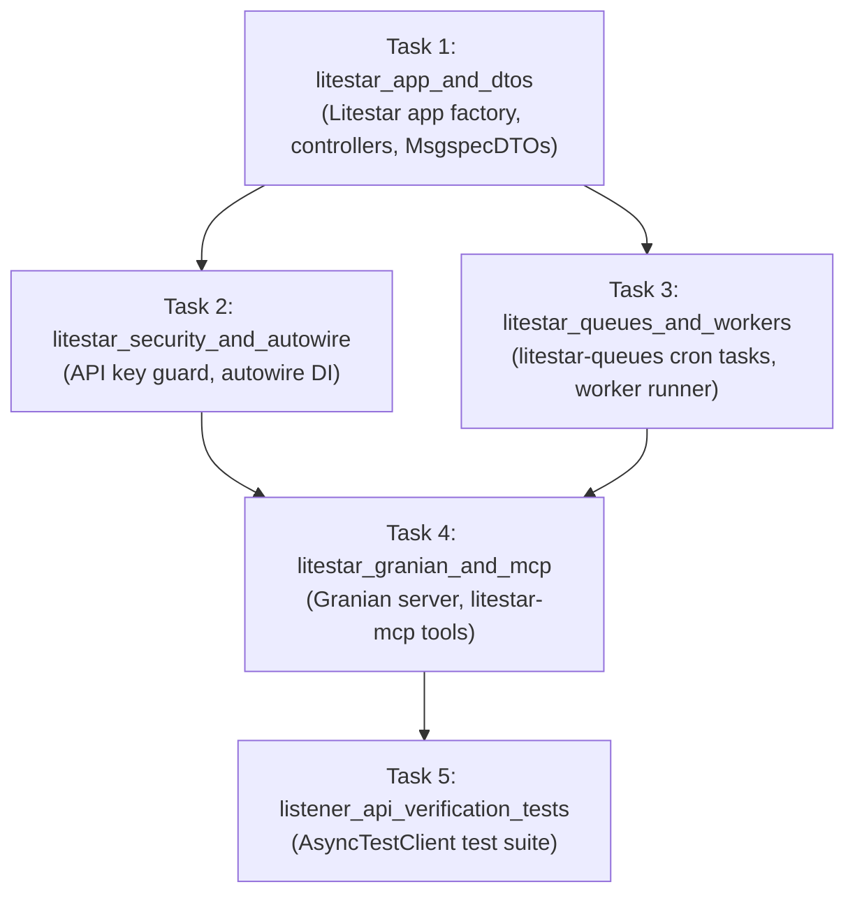

# Flow: Next-Generation Litestar Listener Service & Ecosystem

**Flow ID:** `litestar_listener_overhaul_20260823`  
**Parent Roadmap:** `modernization_overhaul_20260823` (Chapter 4)  
**Promoted Research:** `modernization_overhaul_20260822`

## 1. Specification & Context

### 1.1 Architectural Rationale
The GOE Listener service provides a REST API and background worker daemon for orchestrating offloads, introspection of database schemas, telemetry publishing, and real-time execution monitoring.

Historically, the listener subsystem relied on:
- Legacy FastAPI 0.77.0, Uvicorn 0.17.6, Gunicorn 20.1.0, and Pydantic v1.
- Custom daemon subprocesses (`src/goe/listener/worker.py`, `src/goe/listener/heartbeat.py`) and unbundled `goelib_contrib.worker`.
- Ad-hoc security middleware and manual exception translation.

This specification rebuilds the service on **Litestar (>= 2.8.0)** and its first-party ecosystem components:
1. **`litestar-granian[uvloop]`**: Rust-based, multi-threaded ASGI runtime.
2. **`litestar-queues[sqlspec]`**: Distributed background job dispatching and cron-scheduled tasks (`publish-command-executions`, `publish-schemas`, `publish-heartbeat`), strictly replacing custom worker daemons (and explicitly avoiding `litestar-saq`).
3. **`litestar-security`**: Constant-time API key verification for `x-goe-console-key`.
4. **`litestar-autowire`**: Declarative DI for configuration, repository clients, and Redis connections.
5. **`litestar-mcp`**: Exposing GOE operations as tools and resources for Model Context Protocol agents.
6. **`MsgspecDTO`**: Zero-overhead request/response validation and automated OpenAPI UI generation.

### 1.2 Requirements

#### Functional Requirements
1. Eliminate all dependencies on `fastapi`, `uvicorn`, `gunicorn`, and `goelib_contrib`.
2. Implement native `Litestar` application factory in `src/goe/listener/app.py`.
3. Create modular `SystemController` (`/api/system/*`) and `OrchestrationController` (`/api/orchestration/*`).
4. Implement `litestar-security` API key guard for `x-goe-console-key` header authentication.
5. Implement `litestar-autowire` dependency injection providers for `OrchestrationConfig`, `OffloadMessages`, `OrchestrationRepoClientInterface`, `SystemService`, and `RedisClient`.
6. Migrate periodic background jobs to `litestar-queues[sqlspec]`.
7. Configure `litestar-granian` server runner (`src/goe/listener/server.py`).
8. Expose GOE tools and resources via `litestar-mcp`.
9. Maintain 100% JSON contract compatibility with legacy REST endpoints.
10. Author end-to-end Listener API tests using Litestar's `AsyncTestClient`.

---

## 2. Implementation Plan

### Phase 1: Application Factory & DTOs
- [ ] `litestar_app_and_dtos`: Create Litestar application factory, controllers, and `MsgspecDTO` schemas matching existing REST endpoints.

### Phase 2: Security & Dependency Injection
- [ ] `litestar_security_and_autowire`: Implement `litestar-security` authentication guard for `x-goe-console-key` and configure `litestar-autowire`.

### Phase 3: Task Queues & Workers
- [ ] `litestar_queues_and_workers`: Migrate periodic Redis jobs and background tasks to `litestar-queues[sqlspec]`.

### Phase 4: Server Runtime & MCP
- [ ] `litestar_granian_and_mcp`: Configure `litestar-granian` server CLI runner and expose MCP tools via `litestar-mcp`.

### Phase 5: Integration Testing
- [ ] `listener_api_verification_tests`: Implement comprehensive API tests with `AsyncTestClient` validating all routes, auth guards, and error handlers.\n