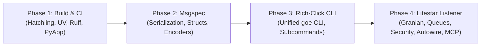

# GOE Modernization & Architectural Overhaul

## 1. Executive Summary

This research document defines the comprehensive strategy for modernizing the **GOE (Gluent Offload Engine)** repository. By synthesizing best practices and battle-tested patterns from Cody's **DMA ecosystem** (`dma/collector`, `dma/beekeeper`, `dma/framework`, `dma/assistant`) and analyzing the existing migration branches (`origin/msgspec` and `origin/litestar`), we establish an ordered 4-pillar architectural roadmap:

1. **Pillar 1: Modern Build System, Tooling & CI/CD Pipeline**
   - Migrate packaging from legacy `setuptools`/`setup.py` to `hatchling.build` with PEP 621 metadata and PEP 735 `[dependency-groups]`.
   - Standardize on `uv` for lightning-fast, reproducible dependency locking (`uv.lock`).
   - Replace fragmented formatting/linting with `ruff` (`line-length = 120`, Google docstring convention) and strict `mypy`/`pyright`.
   - Implement modernized GitHub Actions CI matrix testing with `astral-sh/setup-uv@v7` and standalone multi-platform binary compilation via `pyapp` + `cargo-zigbuild`.
2. **Pillar 2: High-Performance Serialization Overhaul with `msgspec`**
   - Completely eliminate `orjson` across core orchestration, persistence (`OrchestrationRepoClient`), messaging (`OffloadMessages`), and Redis streaming.
   - Leverage `msgspec.json.Encoder(enc_hook=...)` for high-throughput serialization of complex types (`Decimal`, `datetime`, `ExecutionId`, `GenericPredicate`).
   - Define typed `msgspec.Struct` models for configuration, metadata schemas, and telemetry events.
3. **Pillar 3: Unified CLI Entrypoints with `rich-click`**
   - Replace legacy Python 2-era `optparse` and disjoint `/bin/*` wrapper scripts with a consolidated, modern CLI suite powered by `rich-click`.
   - Provide structured command groups (`goe offload`, `goe connect`, `goe validate`, `goe sync`, `goe listener`, `goe logmgr`) with colorized help, typed parameter parsing, interactive prompts, and rich tabular output.
4. **Pillar 4: Next-Generation Listener Service with Litestar Ecosystem**
   - Replace legacy `FastAPI` (0.77.0), `uvicorn` (0.17.6), and `gunicorn` (20.1.0) with **Litestar** (>= 2.8+).
   - Integrate first-party ecosystem components: `litestar-granian` (Rust-based Granian runtime with uvloop), `litestar-saq` / `litestar-queues` (replacing custom worker subprocesses), `litestar-security` / token auth guards, `MsgspecDTO` for zero-overhead validation, and auto-generated OpenAPI schemas.

---

## 2. Codebase Analysis (Current vs Target State)

```
┌────────────────────────────────────────────────────────────────────────────────────────┐
│                                   CURRENT STATE                                        │
├───────────────────┬───────────────────┬────────────────────────┬───────────────────────┤
│ Build & Tooling   │ Serialization     │ CLI Entrypoints        │ Listener Service      │
│ • setuptools      │ • orjson          │ • optparse             │ • FastAPI 0.77.0      │
│ • Makefile script │ • raw json.dumps  │ • bin/offload (script) │ • Uvicorn 0.17.6      │
│ • black (only)    │ • untyped dicts   │ • bin/connect (script) │ • Gunicorn 20.1.0     │
│ • manual venv     │ • manual parsing  │ • bin/agg_validate     │ • custom worker daemon│
└───────────────────┴───────────────────┴────────────────────────┴───────────────────────┘
                                       │
                                       ▼ MIGRATION
┌────────────────────────────────────────────────────────────────────────────────────────┐
│                                    TARGET STATE                                        │
├───────────────────┬───────────────────┬────────────────────────┬───────────────────────┤
│ Build & Tooling   │ Serialization     │ CLI Entrypoints        │ Listener Service      │
│ • hatchling       │ • msgspec         │ • rich-click           │ • Litestar 2.8+       │
│ • uv + uv.lock    │ • msgspec.Struct  │ • unified `goe` CLI    │ • litestar-granian    │
│ • ruff + mypy     │ • enc_hook / DTOs │ • rich tables & panels │ • litestar-saq        │
│ • PyApp binaries  │ • msgspec.msgpack │ • click subcommands    │ • MsgspecDTO / Guards │
└───────────────────┴───────────────────┴────────────────────────┴───────────────────────┘
```

---

## 3. Prior Art & Reference Patterns from DMA Ecosystem

### 3.1 Build & Packaging Configuration (`dma/collector/pyproject.toml`)
- **Build Backend**:
  ```toml
  [build-system]
  build-backend = "hatchling.build"
  requires = ["hatchling"]

  [tool.hatch.build]
  dev-mode-dirs = ["src/"]
  sources = ["src"]
  ```
- **UV Dependency Groups (PEP 735)**:
  ```toml
  [tool.uv]
  managed = true
  package = true

  [dependency-groups]
  dev = ["bump-my-version", { include-group = "lint" }, { include-group = "test" }, { include-group = "docs" }]
  test = ["pytest>=9.0", "pytest-cov>=5.0", "pytest-xdist>=3.6", "pytest-click", "filelock>=3.0"]
  lint = ["mypy>=1.13.0", "ruff>=0.14.0", "types-click", "types-pyyaml", "pre-commit"]
  ```
- **Ruff Linter & Formatter Rules**:
  - `target-version = "py310"`, `line-length = 120`, Google docstring convention.
  - Comprehensive rule selection (`lint.select = ["ALL"]`) with pragmatic ignores for CLI/test ergonomics.

### 3.2 Serialization Patterns (`origin/msgspec` branch & `dma/collector`)
- Custom encoding hook for domain objects:
  ```python
  import decimal, datetime, msgspec

  def _default(value: Any) -> str:
      if isinstance(value, (decimal.Decimal, datetime.datetime, ExecutionId)):
          return str(value)
      elif isinstance(value, GenericPredicate):
          return value.dsl
      try:
          return str(value)
      except Exception as exc:
          raise TypeError from exc

  _msgspec_json_encoder = msgspec.json.Encoder(enc_hook=_default)
  _msgspec_json_decoder = msgspec.json.Decoder()

  def serialize_object(obj: Any) -> str:
      return _msgspec_json_encoder.encode(obj).decode("utf-8")

  def deserialize_object(payload: bytes | str) -> Any:
      return msgspec.json.decode(payload)
  ```

### 3.3 CLI Application Patterns (`dma/beekeeper/manage.py`)
- Rich-Click styling and group structure:
  ```python
  import rich_click as click
  from rich.console import Console

  click.rich_click.USE_RICH_MARKUP = True
  click.rich_click.SHOW_ARGUMENTS = True
  click.rich_click.GROUP_ARGUMENTS_OPTIONS = True
  click.rich_click.STYLE_ERRORS_SUGGESTION = "yellow italic"
  click.rich_click.ERRORS_SUGGESTION = "Try running '--help' for available options."

  @click.group(context_settings={"help_option_names": ["-h", "--help"]})
  @click.version_option(package_name="goe-framework")
  def cli() -> None:
      """GOE - Gluent Offload Engine CLI."""
  ```

### 3.4 Litestar Application & Ecosystem Services (`dma/beekeeper/pyproject.toml`)
- Dependencies & Ecosystem:
  - `litestar[jinja,jwt,structlog]>=2.8.0`
  - `litestar-granian[uvloop]` (Rust-based Granian runtime)
  - `litestar-queues[sqlspec]` (Background tasks & distributed queue worker)
  - `litestar-security[argon2,mfa,passkeys]` (Security context, guards, API key & token auth)
  - `litestar-autowire[dishka,queues]` (Autowiring and dependency injection)
  - `litestar-mcp` (Model Context Protocol server integration)
- Replaces Gunicorn + Uvicorn worker supervisor and custom queue daemons with native Granian + litestar-queues + litestar-autowire.

---

## 4. Four-Pillar Modernization Architecture & Plan

### Pillar 1: Build System, Modern Tooling & CI/CD Pipeline
1. **`pyproject.toml` Overhaul**:
   - Adopt `hatchling.build` as the build system.
   - Configure PEP 735 `[dependency-groups]` (`dev`, `test`, `lint`, `docs`, `build`).
   - Define optional dependency sets (`oracle`, `bigquery`, `snowflake`, `synapse`, `teradata`, `hadoop`, `listener`, `all`).
2. **Code Quality Modernization**:
   - Replace separate `black` calls with unified `ruff format` and `ruff check --fix`.
   - Add strict type checking configuration (`[tool.mypy]` and `[tool.pyright]`).
   - Add `bump-my-version` configuration for semantic versioning.
3. **Makefile Modernization**:
   - Re-architect `Makefile` using DMA standards: `install`, `upgrade`, `lint`, `format`, `test`, `test-unit`, `test-integration`, `build`, `package`, `clean`.
4. **GitHub Actions CI Modernization**:
   - Scaffolding `.github/workflows/ci.yaml`, `test.yaml`, `release.yaml` using Astral `setup-uv@v7`.
   - Multi-matrix testing across Python 3.10, 3.11, 3.12, 3.13 on Linux, macOS, and Windows.
   - PyApp standalone cross-compiled binary build step (`cargo-zigbuild`).

### Pillar 2: Complete `msgspec` Serialization Migration
1. **Core Serialization Module**:
   - Modernize `src/goe/util/json_tools.py` with `msgspec.json.Encoder` and `Decoder`.
   - Update `src/goe/persistence/orchestration_repo_client.py` (`type_safe_json_dumps`) to use `msgspec`.
   - Update `src/goe/offload/offload_messages.py` Redis streaming to serialize log events with `msgspec`.
2. **Schema & Struct Definitions**:
   - Convert dictionary schemas in `src/goe/listener/schemas/` to `msgspec.Struct` definitions.
   - Replace custom dict serialization in `OrchestrationMetadata` and `CommandExecution` with typed `msgspec.Struct`.
3. **Performance Optimization**:
   - Use `msgspec.msgpack` for high-throughput Redis caching where binary packing is preferred.

### Pillar 3: Modern `rich-click` CLI Architecture
1. **Entrypoint Unification**:
   - Build a root CLI entry point `goe` (`src/goe/cli/main.py`) registered in `[project.scripts]`.
2. **Subcommand Hierarchy**:
   - `goe offload`: Full and incremental data offloading with rich option groups (source options, target options, partitioning, transport).
   - `goe connect`: Pre-flight environment and connectivity verification with colored checkmark status grids.
   - `goe validate`: Aggregation and row count validation (`agg_validate`).
   - `goe sync`: Schema drift inspection and automated DDL migration (`schema_sync`).
   - `goe listener`: Multi-process or Granian-managed Listener REST service runner.
   - `goe logmgr`: Log archiving and cleanup management.
3. **Backward Compatibility**:
   - Retain executable wrappers in `bin/` (`bin/offload`, `bin/connect`, etc.) that delegate cleanly to `goe <subcommand>` with deprecation notices.

### Pillar 4: Litestar & Ecosystem Integration for Listener
1. **Application Modernization**:
   - Replace `src/goe/listener/asgi.py` (FastAPI) with a native `Litestar` application factory.
   - Implement `MsgspecDTO` for request/response schemas.
   - Implement `litestar-security` guard with `APIKeyHeader` / token authentication matching existing `x-goe-console-key`.
   - Implement `litestar-autowire` for clean dependency injection and service lifecycles.
   - Implement `litestar-mcp` for exposing GOE orchestration capabilities to MCP agents.
2. **Server Runtime (`litestar-granian`)**:
   - Replace Gunicorn / Uvicorn worker setup with `litestar-granian` supporting multi-threaded uvloop async execution.
3. **Task Queue & Scheduling (`litestar-queues`)**:
   - Replace custom worker supervisor (`src/goe/listener/worker.py` and `goelib_contrib.worker`) with `litestar-queues` running Redis-backed periodic cron tasks (`publish-command-executions`, `publish-schemas`) and asynchronous offload dispatching.
4. **Interactive Documentation**:
   - Litestar automatic OpenAPI generation with Swagger, Redoc, and Scalar UI.

---

## 5. Technical Risk Assessment & Mitigation

| Risk | Impact | Mitigation Strategy |
| :--- | :--- | :--- |
| **Backward CLI Incompatibility** | Scripts expecting `bin/offload` or specific flags fail | Provide transparent wrapper scripts in `bin/` that invoke `rich-click` CLI; maintain alias support for all legacy flags. |
| **Serialization Type Mismatches** | `msgspec` fails on unexpected Oracle/NumPy types | Implement comprehensive `enc_hook` in `_default()` handling `Decimal`, `datetime`, `date`, `ExecutionId`, `GenericPredicate`, `np.ndarray`, `np.generic`. |
| **API Contract Drift on Litestar** | External GOE Console / UI breaks | Maintain identical JSON route paths (`/api/system/*`, `/api/orchestration/*`), response structures, error shapes, and header keys (`x-goe-console-key`). |
| **Python Version Support** | Upgrading build tools might impact older Python runtime | Align target version with modern Python (>= 3.10) while preserving multi-platform build matrices in CI. |

---

## 6. Phased Implementation Roadmap (Ordered Execution)

To ensure smooth delivery without architectural regression, the overhaul should be executed in 4 sequential Flow specs:



1. **Spec 1: `build_ci_overhaul`**
   - Modernize `pyproject.toml` (Hatchling, UV dependency groups), `Makefile`, `ruff.toml` / Ruff settings, and GitHub Actions CI workflow.
2. **Spec 2: `msgspec_overhaul`**
   - Replace `orjson` with `msgspec` across `json_tools.py`, `orchestration_repo_client.py`, `offload_messages.py`, and Redis streaming.
3. **Spec 3: `rich_click_cli_overhaul`**
   - Implement unified `src/goe/cli/` suite with `rich-click`, migrate `optparse` options, and build rich tabular terminal interfaces.
4. **Spec 4: `litestar_listener_overhaul`**
   - Replace FastAPI/Gunicorn with Litestar + `litestar-granian` + `litestar-queues` + `litestar-security` + `litestar-autowire` + `litestar-mcp`.
