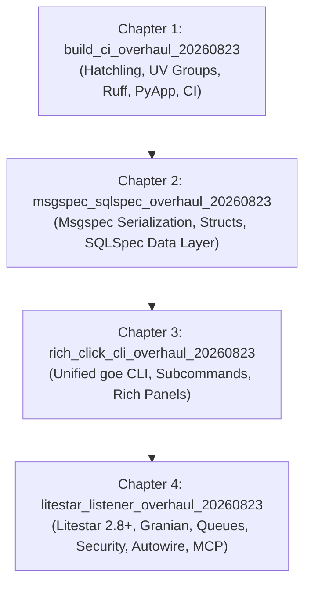

# PRD: GOE Modernization Master Roadmap

**PRD ID:** `modernization_overhaul_20260823`

## Executive Summary

The GOE (Gluent Offload Engine) framework is undergoing a complete architectural modernization. Aligning with standards established across Cody's DMA ecosystem (`collector`, `beekeeper`, `db-skus`, `accelerator`), this roadmap decomposes the modernization into 4 sequential child flows:

---

## Child Flows (Chapters)

### Chapter 1: Build Tooling, UV Dependency Groups, Ruff & GitHub Actions CI
- **Flow ID:** `build_ci_overhaul_20260823`
- **Scope:**
  - Migrate `pyproject.toml` to `hatchling.build` with PEP 621 metadata (`requires-python = ">=3.10"`).
  - Structure dependencies using PEP 735 `[dependency-groups]` (`dev`, `test`, `lint`, `docs`, `build`).
  - Preserve multi-cloud connector extras (`hadoop`, `snowflake`, `sql_server`, `synapse`, `teradata`) in `[project.optional-dependencies]`.
  - Configure `ruff` (linter & formatter, line-length 120, Google docstrings) and strict `mypy`/`pyright`.
  - Re-engineer `Makefile` with DMA targets and preserved sub-make packaging targets (`target`, `spark-listener`, `offload-env`, `package`).
  - Scaffold `.github/workflows/` (`ci.yaml`, `test.yaml`, `release.yaml`) with `actions/checkout@v4` and `astral-sh/setup-uv@v5`.
  - Provide `tools/bundle_python.py` for cross-compiled standalone PyApp binaries.

### Chapter 2: High-Performance Msgspec Serialization & SQLSpec Data Layer
- **Flow ID:** `msgspec_sqlspec_overhaul_20260823`
- **Scope:**
  - Replace `orjson` completely across `src/goe/util/json_tools.py`, `src/goe/persistence/orchestration_repo_client.py`, and `src/goe/offload/offload_messages.py`.
  - Implement `msgspec.json.Encoder(enc_hook=_default)` supporting `Decimal`, `datetime`, `ExecutionId`, `GenericPredicate`, and NumPy types.
  - Define typed `msgspec.Struct` models for schemas, telemetry, and execution metadata.
  - Integrate `sqlspec[duckdb,performance,asyncpg,mypyc,fsspec,uuid,adbc,oracledb,adk]>=0.61.0` as the authoritative SQL and database abstraction library.

### Chapter 3: Unified Rich-Click CLI Suite & Interactive Terminal UX
- **Flow ID:** `rich_click_cli_overhaul_20260823`
- **Scope:**
  - Build unified `goe` root CLI in `src/goe/cli/main.py` registered under `[project.scripts]`.
  - Implement subcommands: `goe offload`, `goe connect`, `goe validate`, `goe sync`, `goe listener`, `goe logmgr`.
  - Replace legacy `optparse` with typed `rich-click` options, colored status panels, and rich table summaries.
  - Maintain transparent wrapper scripts in `bin/` for backward compatibility.

### Chapter 4: Next-Generation Litestar Listener Service & Ecosystem
- **Flow ID:** `litestar_listener_overhaul_20260823`
- **Scope:**
  - Replace FastAPI 0.77 / Uvicorn / Gunicorn with `litestar>=2.8.0`.
  - Integrate `litestar-granian[uvloop]` for multi-threaded Rust ASGI runtime.
  - Integrate `litestar-queues[sqlspec]` for background job execution and periodic Redis cron tasks (NO `litestar-saq`).
  - Integrate `litestar-security[argon2,mfa,passkeys]` for token/API key authentication (`x-goe-console-key`).
  - Integrate `litestar-autowire[dishka,queues]` for clean dependency injection and service lifecycle wiring.
  - Integrate `litestar-mcp` for exposing GOE orchestration capabilities to Model Context Protocol agents.
  - Provide `MsgspecDTO` integration and automatic OpenAPI documentation.
