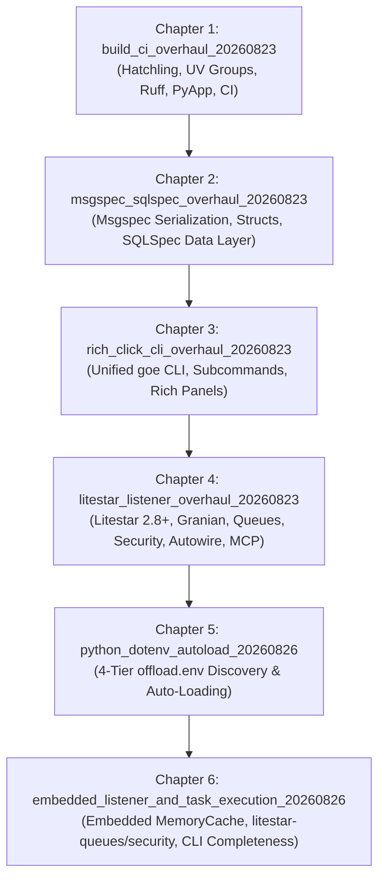

# PRD: GOE Modernization Master Roadmap

**PRD ID:** `modernization_overhaul_20260823`

## Executive Summary

The GOE (Gluent Offload Engine) framework is undergoing a complete architectural modernization, decomposed into sequential child flows:

```mermaid
flowchart TD
    C1["Chapter 1: build_ci_overhaul_20260823\n(Hatchling, UV Groups, Ruff, PyApp, CI)"] --> C2["Chapter 2: msgspec_sqlspec_overhaul_20260823\n(Msgspec Serialization, Structs, SQLSpec Data Layer)"]
    C2 --> C3["Chapter 3: rich_click_cli_overhaul_20260823\n(Unified goe CLI, Subcommands, Rich Panels)"]
    C3 --> C4["Chapter 4: litestar_listener_overhaul_20260823\n(Litestar 2.8+, Granian, Queues, Security, Autowire, MCP)"]
    C4 --> C5["Chapter 5: python_dotenv_autoload_20260826\n(4-Tier offload.env Discovery & Auto-Loading)"]
    C5 --> C6["Chapter 6: embedded_listener_and_task_execution_20260826\n(Embedded MemoryCache, litestar-queues/security, CLI Completeness)"]
```

---

## Child Flows (Chapters)

### Chapter 1: Build Tooling, UV Dependency Groups, Ruff & GitHub Actions CI
- **Flow ID:** `build_ci_overhaul_20260823` (Completed)
- **Scope:**
  - Migrate `pyproject.toml` to `hatchling.build` with PEP 621 metadata (`requires-python = ">=3.12"`).
  - Structure dependencies using PEP 735 `[dependency-groups]` (`dev`, `test`, `lint`, `docs`, `build`).
  - Preserve multi-cloud connector extras (`hadoop`, `snowflake`, `sql_server`, `synapse`, `teradata`) in `[project.optional-dependencies]`.
  - Configure `ruff` (linter & formatter, line-length 120, Google docstrings, `CPY001` SPDX check) and strict `mypy`/`pyright`.
  - Re-engineer `Makefile` with standard developer lifecycle targets and preserved sub-make packaging targets (`target`, `spark-listener`, `offload-env`, `package`).
  - Scaffold `.github/workflows/` (`ci.yaml`, `test.yaml`, `release.yaml`) with `actions/checkout@v4` and `astral-sh/setup-uv@v5`.
  - Provide `tools/bundle_python.py` for cross-compiled standalone PyApp binaries.

### Chapter 2: High-Performance Msgspec Serialization & SQLSpec Data Layer
- **Flow ID:** `msgspec_sqlspec_overhaul_20260823` (Completed)
- **Scope:**
  - Replace `orjson` completely across `src/goe/util/json_tools.py`, `src/goe/persistence/orchestration_repo_client.py`, and `src/goe/offload/offload_messages.py`.
  - Implement `msgspec.json.Encoder(enc_hook=_default)` supporting `Decimal`, `datetime`, `ExecutionId`, `GenericPredicate`, and NumPy types.
  - Define typed `msgspec.Struct` models (`BaseStruct`) for schemas, telemetry, and execution metadata.
  - Integrate `sqlspec` as the authoritative SQL and database abstraction library.

### Chapter 3: Unified Rich-Click CLI Suite & Interactive Terminal UX
- **Flow ID:** `rich_click_cli_overhaul_20260823` (Completed)
- **Scope:**
  - Build unified `goe` root CLI in `src/goe/cli/main.py` registered under `[project.scripts]`.
  - Implement subcommands: `goe offload`, `goe connect`, `goe validate`, `goe sync`, `goe listener`, `goe logmgr`, `goe status`, `goe version`.
  - Replace legacy `optparse` with typed `rich-click` options across all 10 `OPTION_GROUPS["goe offload"]` panels, colored status panels, and rich table summaries.
  - Maintain transparent wrapper scripts in `bin/` with `DeprecationWarning` targeting removal in GOE 2.0.0.

### Chapter 4: Next-Generation Litestar Listener Service & Ecosystem
- **Flow ID:** `litestar_listener_overhaul_20260823` & `embedded_listener_and_task_execution_20260826` (Completed)
- **Scope:**
  - Replace FastAPI 0.77 / Uvicorn / Gunicorn / Valkey / Redis with `litestar>=2.8.0` and an embedded in-process `MemoryCache`.
  - Integrate `litestar-granian[uvloop]` for multi-threaded Rust ASGI runtime.
  - Integrate `litestar-queues` (`queue_backend="memory"`, `WorkerConfig(placement="asgi")`) for background job execution and periodic cron tasks.
  - Integrate `litestar-security` for constant-time API key authentication (`x-goe-console-key` against `OFFLOAD_LISTENER_SHARED_TOKEN`).
  - Integrate `litestar-autowire` (`AutowireConfig(domain_packages=["goe.listener"], integrations=["queues"])`) and Litestar 2.24 native `NamedDependency`, `FromPath`, `FromQuery`, and `JSONBody` annotations.
  - Integrate `litestar-mcp` (`LitestarMCP`) exposing Listener endpoints as MCP tools (`mcp_tool=`).
  - Provide `BaseStruct` (`msgspec.Struct`) DTO integration and automatic OpenAPI documentation.

### Chapter 5: Automatic `offload.env` Loading via `python-dotenv`
- **Flow ID:** `python_dotenv_autoload_20260826` (Completed)
- **Scope:**
  - 4-tier environment discovery (`GOE_CONFIG_FILE` / `OFFLOAD_ENV_FILE`, `$OFFLOAD_HOME/conf/offload.env`, upward `dotenv.find_dotenv`, and standard system paths) with POSIX interpolation (`interpolate=True`, `override=False`), automatic `OFFLOAD_HOME` export, and `PYTEST_CURRENT_TEST` / `GOE_NO_AUTOLOAD_ENV` test isolation.
