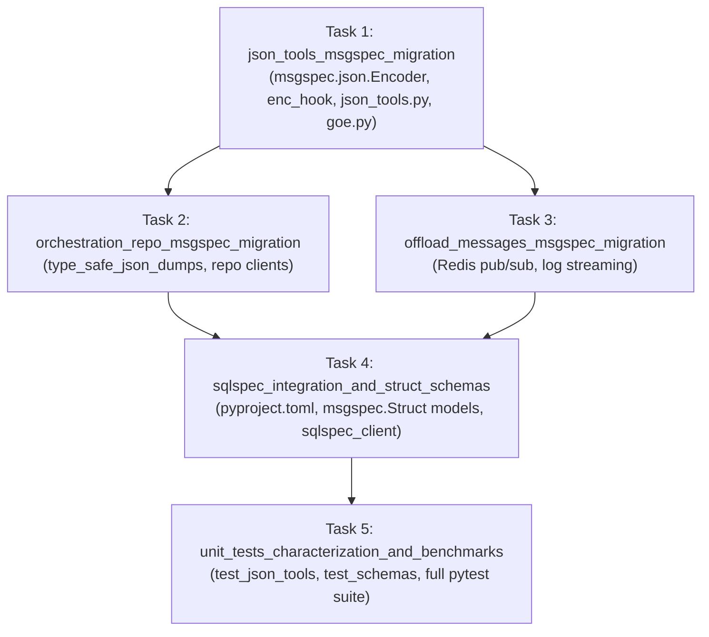

# Flow: High-Performance Msgspec Serialization & SQLSpec Data Layer

**Flow ID:** `msgspec_sqlspec_overhaul_20260823`  
**Parent Roadmap:** `modernization_overhaul_20260823` (Chapter 2)  
**Promoted Research:** `modernization_overhaul_20260822`

## 1. Specification & Context

### 1.1 Architectural Rationale
In GOE's high-throughput data orchestration pipeline, JSON serialization is executed across multiple critical paths:
1. **Metadata Repositories**: Execution parameters, column definitions, partition catalogs, and offload statuses persisted into Oracle, Teradata, and backend metastores.
2. **Real-Time Telemetry & Log Streaming**: Per-line stdout/file log records published to Redis lists (`goe:run:{execution_id}`) via `OffloadMessages`.
3. **Listener & Conductor REST API**: HTTP endpoints exchanging large schemas, table attributes, and validation payloads.

Historically, the codebase used a fragmented mix of `orjson`, standard library `json.dumps`, and manual string manipulations, introducing subtle type-conversion discrepancies across `Decimal`, `datetime`, NumPy scalars/arrays, `ExecutionId`, and `GenericPredicate` ASTs.

This specification modernizes the serialization layer around **`msgspec`** (`msgspec.json.Encoder` with a unified domain `enc_hook=_default`, zero-copy `Decoder`, and typed `msgspec.Struct` definitions) and integrates **`sqlspec`** (`sqlspec[duckdb,performance,asyncpg,mypyc,fsspec,uuid,adbc,oracledb,adk]>=0.61.0`) as the foundational database abstraction and query execution framework.

### 1.2 Requirements

#### Functional Requirements
1. **Zero `orjson` Dependency**: Completely eliminate `orjson` across all files (`src/goe/util/json_tools.py`, `src/goe/persistence/orchestration_repo_client.py`, `src/goe/offload/offload_messages.py`, `src/goe/goe.py`, `src/goe/listener/api/routes/system.py`, `src/goe/listener/services/hybrid_view.py`, and `pyproject.toml`).
2. **Unified `msgspec` JSON Engine**: Implement high-throughput `serialize_object` and `deserialize_object` in `src/goe/util/json_tools.py` with custom `enc_hook=_default` handling:
   - `decimal.Decimal` -> string representation
   - `datetime.datetime` / `datetime.date` -> ISO-8601 UTC string
   - `ExecutionId` -> 36-character UUID string
   - `GenericPredicate` -> DSL string representation (`.dsl`)
   - `np.generic` (e.g. `np.int64`, `np.float64`) -> native Python scalar (`.item()`)
   - `np.ndarray` -> nested Python list (`.tolist()`)
   - `uuid.UUID` -> string
   - `set` / `frozenset` -> list
   - `Exception` -> string message
3. **Repository State Serialization**: Modernize `src/goe/persistence/orchestration_repo_client.py` (`type_safe_json_dumps`, `type_safe_json_loads`, `_metadata_dict_to_json_string`, `_prepare_command_parameters`) and downstream client implementations (`oracle_orchestration_repo_client.py`, `teradata_orchestration_repo_client.py`) using `msgspec`.
4. **Redis Messaging Serialization**: Modernize `src/goe/offload/offload_messages.py` Redis publishing (`goe:run:{execution_id}`) to serialize with `msgspec`.
5. **Typed `msgspec.Struct` Data Models**: Define structured, memory-efficient `msgspec.Struct` models in `src/goe/persistence/schemas.py` for:
   - `CommandExecutionSchema`
   - `OffloadMetadataSchema`
   - `StepDetailSchema`
   - `LogEventSchema`
   - `PartitionMetadataSchema`
6. **SQLSpec Integration**: Add `sqlspec` to `pyproject.toml` and provide core client abstractions in `src/goe/persistence/sqlspec_client.py`.

#### Non-Functional Requirements
- **100% Backward Compatibility**: Serialized JSON outputs must remain format-compatible with existing Oracle/Teradata metadata tables, Redis subscribers, and REST consumers.
- **Zero Test Regressions**: All 43+ unit test modules in `tests/unit/` must pass cleanly without warning or failure.
- **Strict Typing & Performance**: All new modules must satisfy type checkers and leverage C-extension speedups provided by `msgspec`.

---

## 2. Requirements-to-Task Traceability Matrix

| Requirement | Description | Assigned Task ID |
| :--- | :--- | :--- |
| **REQ-1** | Core `json_tools.py` msgspec engine & domain `enc_hook` | `msgspec_sqlspec_overhaul_20260823:json_tools_msgspec_migration` |
| **REQ-2** | Repository persistence migration (`orchestration_repo_client.py`) | `msgspec_sqlspec_overhaul_20260823:orchestration_repo_msgspec_migration` |
| **REQ-3** | Messaging & Redis pub/sub migration (`offload_messages.py`) | `msgspec_sqlspec_overhaul_20260823:offload_messages_msgspec_migration` |
| **REQ-4** | SQLSpec library integration & typed `msgspec.Struct` schemas | `msgspec_sqlspec_overhaul_20260823:sqlspec_integration_and_struct_schemas` |
| **REQ-5** | Comprehensive unit tests, characterization, and benchmarks | `msgspec_sqlspec_overhaul_20260823:unit_tests_characterization_and_benchmarks` |

---

## 3. Implementation Plan

### Phase 1: Core Msgspec Engine
- [x] `json_tools_msgspec_migration`: Modernize `src/goe/util/json_tools.py` with `msgspec.json.Encoder(enc_hook=_default)`, decoder, and domain hook. Eliminate `orjson` in `goe.py`.

### Phase 2: Persistence & Messaging Serialization
- [x] `orchestration_repo_msgspec_migration`: Migrate `src/goe/persistence/orchestration_repo_client.py` and Oracle/Teradata clients to `msgspec`.
- [x] `offload_messages_msgspec_migration`: Migrate `src/goe/offload/offload_messages.py` Redis publisher to `msgspec`.

### Phase 3: SQLSpec Integration & Struct Schemas
- [x] `sqlspec_integration_and_struct_schemas`: Add `sqlspec` and `msgspec` dependencies to `pyproject.toml`, remove `orjson`, and create typed `msgspec.Struct` models in `src/goe/persistence/schemas.py`.

### Phase 4: Verification & Characterization Testing
- [x] `unit_tests_characterization_and_benchmarks`: Implement dedicated unit tests (`tests/unit/util/test_json_tools.py`, `tests/unit/persistence/test_schemas.py`) and verify 100% green test execution across `tests/unit/`.\n