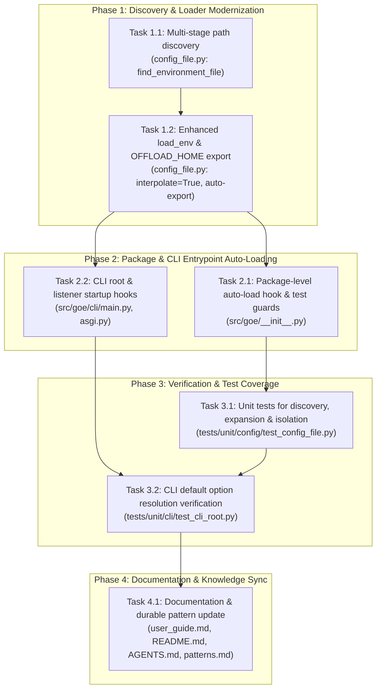

# Flow: Automatic offload.env Loading via python-dotenv & Modernized Environment Discovery

**Flow ID:** `python_dotenv_autoload_20260826`  
**Parent Roadmap:** `modernization_overhaul_20260823`  
**Research Reference:** [`.agents/bundles/specs/python_dotenv_autoload_20260826/research/research.md`](file:///usr/local/google/home/codyfincher/code/gluent/next-goe/.agents/bundles/specs/python_dotenv_autoload_20260826/research/research.md)

---

## 1. Specification & Context

### 1.1 Architectural Rationale
Historically, the Gluent Offload Engine (`GOE`) assumed that developers or administrators manually configured and exported the `OFFLOAD_HOME` environment variable before running operations. Sourcing in shell scripts ([`tools/goe-shell-functions.sh:83-88`](file:///usr/local/google/home/codyfincher/code/gluent/next-goe/tools/goe-shell-functions.sh#L83-L88)) only verified file existence and exported `OFFLOAD_HOME`, while actual variable loading occurred lazily in Python inside [`OrchestrationConfig.from_dict()`](file:///usr/local/google/home/codyfincher/code/gluent/next-goe/src/goe/config/orchestration_config.py#L333), [`connect()`](file:///usr/local/google/home/codyfincher/code/gluent/next-goe/src/goe/connect/connect.py#L478), and [`agg_validate.py`](file:///usr/local/google/home/codyfincher/code/gluent/next-goe/src/goe/scripts/agg_validate.py#L273).

This latent loading model introduces two major issues:
1. **CLI Default Evaluation Failure**: Click subcommands ([`goe offload`](file:///usr/local/google/home/codyfincher/code/gluent/next-goe/src/goe/cli/commands/offload.py#L136-L158), `goe sync`, `goe validate`) call `get_options()` to resolve option defaults via `orchestration_defaults.*_default()` *before* `OrchestrationConfig.from_dict()` is executed. Consequently, option defaults fall back to `None` or empty strings when `offload.env` is not pre-exported into the shell.
2. **Import-Time Constant Freezing**: Modules defining top-level globals from `os.environ` (e.g. [`DEFAULT_REPORT_DIRECTORY`](file:///usr/local/google/home/codyfincher/code/gluent/next-goe/src/goe/offload/offload_status_report.py#L85) and listener settings) bind unconfigured values upon import.

This flow modernizes configuration discovery and loading using `python-dotenv` (already locked in `pyproject.toml:63`), providing seamless auto-discovery, variable interpolation, and test isolation.

### 1.2 Multi-Stage Discovery Architecture
Environment configuration resolution follows a strict 4-tier hierarchy in [`src/goe/config/config_file.py`](file:///usr/local/google/home/codyfincher/code/gluent/next-goe/src/goe/config/config_file.py):
1. **Tier 1 (Explicit Path)**: `os.environ.get("GOE_CONFIG_FILE")` or `os.environ.get("OFFLOAD_ENV_FILE")`.
2. **Tier 2 (Configured OFFLOAD_HOME)**: `$OFFLOAD_HOME/conf/offload.env` (when `OFFLOAD_HOME` is set).
3. **Tier 3 (Dynamic Workspace Hierarchy)**: Search upward from the current working directory for `conf/offload.env` or `offload.env` via `dotenv.find_dotenv()`.
4. **Tier 4 (Standard System Paths)**: `/opt/goe/offload/conf/offload.env` and `/u01/app/goe/offload/conf/offload.env`.

**Automatic `OFFLOAD_HOME` Export**: When an `offload.env` is discovered in a `.../<home>/conf/offload.env` hierarchy and `OFFLOAD_HOME` is not set in `os.environ`, `config_file.py` automatically populates `os.environ["OFFLOAD_HOME"] = "<home>"`.

### 1.3 Variable Interpolation & Safety Guarantees
- **POSIX Variable Expansion**: `load_env()` executes `dotenv.load_dotenv(path, override=False, interpolate=True)`. Variables like `OFFLOAD_TRANSPORT_USER=${USER}` and `ORACLEDB_THICK_MODE=${USE_ORACLE_WALLET}` resolve in definition order.
- **Precedence**: `override=False` ensures container environment variables, CI runner variables, and test mock dictionaries (`mock.patch.dict(os.environ)`) take precedence over values in `offload.env`.
- **Test Isolation Guard**: Auto-loading in [`src/goe/__init__.py`](file:///usr/local/google/home/codyfincher/code/gluent/next-goe/src/goe/__init__.py) and [`src/goe/cli/main.py`](file:///usr/local/google/home/codyfincher/code/gluent/next-goe/src/goe/cli/main.py) is bypassed when `PYTEST_CURRENT_TEST` is present in `os.environ` or `GOE_NO_AUTOLOAD_ENV=1` is set.

---

## 2. Implementation Plan

### Tasks
- [ ] 1.1 `config_file_multi_stage_discovery`: Implement `find_environment_file()` supporting 4-tier discovery in `src/goe/config/config_file.py`.
- [ ] 1.2 `config_file_load_env_modernization`: Enhance `load_env()` to perform POSIX variable expansion (`interpolate=True`), respect `override=False`, and auto-export `OFFLOAD_HOME`.
- [ ] 2.1 `package_init_autoload_hook`: Implement `_autoload_environment()` in `src/goe/__init__.py` with `PYTEST_CURRENT_TEST` and `GOE_NO_AUTOLOAD_ENV` guards.
- [ ] 2.2 `cli_and_listener_startup_hooks`: Wire early environment auto-loading into `src/goe/cli/main.py`, `src/goe/listener/asgi.py`, and `src/goe/listener/app.py`.
- [ ] 3.1 `unit_tests_config_file`: Author unit tests covering 4-tier path discovery, POSIX interpolation, JSON literal parsing, and test isolation in `tests/unit/config/test_config_file.py`.
- [ ] 3.2 `cli_option_defaults_verification`: Author characterization tests in `tests/unit/cli/` verifying `goe` CLI commands evaluate option defaults against auto-loaded environment variables.
- [ ] 4.1 `docs_and_patterns_update`: Document environment configuration discovery, `GOE_CONFIG_FILE`, `OFFLOAD_ENV_FILE`, and `GOE_NO_AUTOLOAD_ENV` in user documentation and knowledge bundles.
