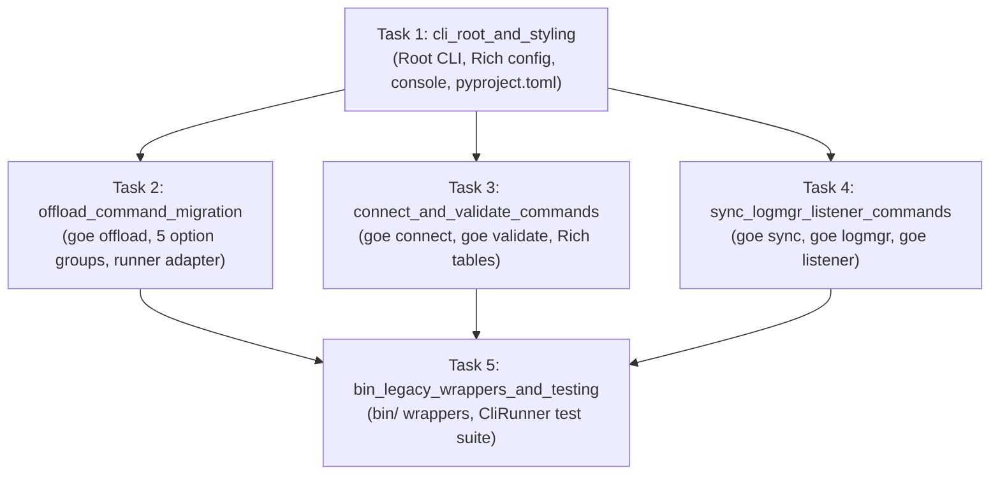

# Flow: Unified Rich-Click CLI Suite & Interactive Terminal UX

**Flow ID:** `rich_click_cli_overhaul_20260823`  
**Parent Roadmap:** `modernization_overhaul_20260823` (Chapter 3)  
**Promoted Research:** `modernization_overhaul_20260822`

## 1. Specification & Architecture

### 1.1 Overview & Motivation
The GOE framework historically relied on Python 2-era `optparse` command definitions and disconnected wrapper scripts in `bin/` (`bin/offload`, `bin/connect`, `bin/agg_validate`, `bin/schema_sync`, `bin/logmgr`, `bin/listener`, `bin/offload_status_report`). This fragmented entrypoint model led to inconsistent option parsing, duplicated validation logic, unstructured help menus, and lack of rich terminal formatting.

This Chapter establishes a centralized, modern CLI suite powered by `rich-click` under `src/goe/cli/`, exposing a single authoritative entrypoint:
```
goe [OPTIONS] COMMAND [ARGS]...
```

### 1.2 Target CLI Architecture & Module Layout
```
src/goe/cli/
├── __init__.py
├── main.py                  # Root Click group (cli), version, global flags, rich configuration
├── config.py                # rich-click styling rules, color palettes, option groups, error suggestions
├── console.py               # Shared Rich console, formatted message/status helpers, progress indicators
└── commands/
    ├── __init__.py
    ├── offload.py           # 'goe offload': Full & incremental offloading with 5 option groups
    ├── connect.py           # 'goe connect': Pre-flight environment & connectivity checks with Rich tables
    ├── validate.py          # 'goe validate': Aggregation & row count verification (agg_validate)
    ├── sync.py              # 'goe sync': Schema drift inspection & target DDL migration (schema_sync)
    ├── listener.py          # 'goe listener': Listener service runner (start, stop, status)
    └── logmgr.py            # 'goe logmgr': Pure Python log archiving & retention management
```

---

## 2. Requirements Matrix

### 2.1 Functional Requirements
1. **Root CLI Entrypoint (`src/goe/cli/main.py`)**:
   - Registered under `pyproject.toml` as `[project.scripts] goe = "goe.cli.main:cli"`.
   - Supports global flags: `-v/--verbose`, `--vv/--vverbose`, `--quiet`, `--no-ansi`, and `--version`.
   - Configures `rich-click` markup, panel styles, option grouping, and command categories.
2. **`goe offload` Subcommand (`src/goe/cli/commands/offload.py`)**:
   - Migrates 40+ legacy options into 5 logical `rich-click` option groups:
     1. *Target & Source Selection* (`-t/--table`, `--target-name`, `--target`)
     2. *Execution & Control* (`-x/--execute`, `-f/--force`, `--skip-steps`, `--ddl-file`, `--create-backend-db`, `--reset-backend-table`, `--reuse-backend-table`, `--reset-hybrid-view`, `--purge`, `--preserve-load-table`, `--compute-load-table-stats`, `--compress-load-table`)
     3. *Partitioning & Incremental Controls* (`--offload-type`, `--older-than-date`, `--older-than-days`, `--less-than-value`, `--equal-to-values`, `--partition-names`, `--partition-columns`, `--partition-granularity`, `--partition-digits`, `--partition-functions`, `--partition-lower-value`, `--partition-upper-value`, `--offload-by-subpartition`, `--max-offload-chunk-size`, `--max-offload-chunk-count`, `--offload-chunk-column`, `--offload-predicate`, `--offload-predicate-type`, `--no-modify-hybrid-view`)
     4. *Data Types & Schema Controls* (`--storage-format`, `--storage-compression`, `--not-null-columns`, `--integer-*-columns`, `--decimal-columns`, `--decimal-columns-type`, `--date-columns`, `--unicode-string-columns`, `--double-columns`, `--variable-string-columns`, `--timestamp-tz-columns`, `--decimal-padding-digits`, `--allow-decimal-scale-rounding`, `--allow-floating-point-conversions`, `--allow-nanosecond-timestamp-columns`, `--data-sample-percent`, `--data-sample-parallelism`)
     5. *Transport & Performance* (`--offload-transport-method`, `--offload-transport-parallelism`, `--offload-transport-dsn`, `--offload-transport-fetch-size`, `--offload-transport-consistent-read`, `--offload-transport-snapshot`, `--offload-transport-spark-properties`, `--offload-transport-queue-name`, `--offload-transport-jvm-overrides`, `--offload-transport-small-table-threshold`, `--offload-fs-scheme`, `--offload-fs-prefix`, `--offload-fs-container`, `--sort-columns`, `--offload-distribute-enabled`, `--verify/--no-verify`, `--verify-parallelism`)
   - Adapts Click parameters into `OrchestrationRunner().offload(...)` execution.
3. **`goe connect` Subcommand (`src/goe/cli/commands/connect.py`)**:
   - Executes pre-flight environment checks (Configuration, Frontend, Backend, Transport, Local, Listener).
   - Renders results into a formatted `rich.table.Table` with colored status badges (`✔ PASS`, `✖ FAIL`, `▲ WARN`).
   - Supports `--upgrade-environment-file` to synchronize `offload.env` with templates.
4. **`goe validate` Subcommand (`src/goe/cli/commands/validate.py`)**:
   - Migrates `agg_validate.py` with typed options (`-t/--table`, `-x/--execute`, `-S/--selects`, `-F/--filters`, `-G/--group-bys`, `-A/--aggregate-functions`, `--as-of-scn`, `--frontend-parallelism`, `--skip-boundary-check`).
   - Renders tabular comparison between source RDBMS and target backend DW aggregations.
5. **`goe sync` Subcommand (`src/goe/cli/commands/sync.py`)**:
   - Migrates `schema_sync` drift detection and target DDL execution with `--include`, `-x/--execute`, `--command-file`.
   - Formats detected column modifications into Rich tables and highlights SQL DDL using `rich.syntax.Syntax`.
6. **`goe logmgr` Subcommand (`src/goe/cli/commands/logmgr.py`)**:
   - Replaces bash script `bin/logmgr` with cross-platform Python implementation supporting `--log-dir`, `--min-age-minutes`, `--archive-dir`, `--dry-run`, and `--purge-days`.
7. **`goe listener` Subcommand (`src/goe/cli/commands/listener.py`)**:
   - Provides commands `goe listener start` (with `--host`, `--port`, `--workers`, `--reload`) and `goe listener status`.
8. **Backward-Compatible `bin/` Wrappers**:
   - Update `bin/offload`, `bin/connect`, `bin/agg_validate`, `bin/schema_sync`, `bin/logmgr`, `bin/listener`, and `bin/offload_status_report` to emit deprecation notices and delegate to `goe <subcommand> "$@"`.
9. **Comprehensive CLI Unit Test Suite (`tests/unit/cli/`)**:
   - Full test coverage using `click.testing.CliRunner` asserting help text, argument validation, exit codes, option groups, and error handling.

---

## 3. Implementation Plan & Worksheets



### Phase 1: Root CLI Application & Rich Configuration
- [ ] `rich_click_cli_overhaul_20260823:cli_root_and_styling`: Build `src/goe/cli/main.py`, `config.py`, `console.py`, configure `rich-click` global markup, and register `[project.scripts] goe = "goe.cli.main:cli"`.

### Phase 2: Core Command Migration
- [ ] `rich_click_cli_overhaul_20260823:offload_command_migration`: Implement `goe offload` migrating options from `optparse` to Click option groups and adapting execution to `OrchestrationRunner`.
- [ ] `rich_click_cli_overhaul_20260823:connect_and_validate_commands`: Implement `goe connect` and `goe validate` subcommands with Rich status tables and progress displays.
- [ ] `rich_click_cli_overhaul_20260823:sync_logmgr_listener_commands`: Implement `goe sync`, `goe logmgr`, and `goe listener` subcommands.

### Phase 3: Backward Compatibility & CLI Testing
- [ ] `rich_click_cli_overhaul_20260823:bin_legacy_wrappers_and_testing`: Update `bin/` scripts to delegate cleanly to `goe` with deprecation notices and author comprehensive `CliRunner` unit test suite.\n