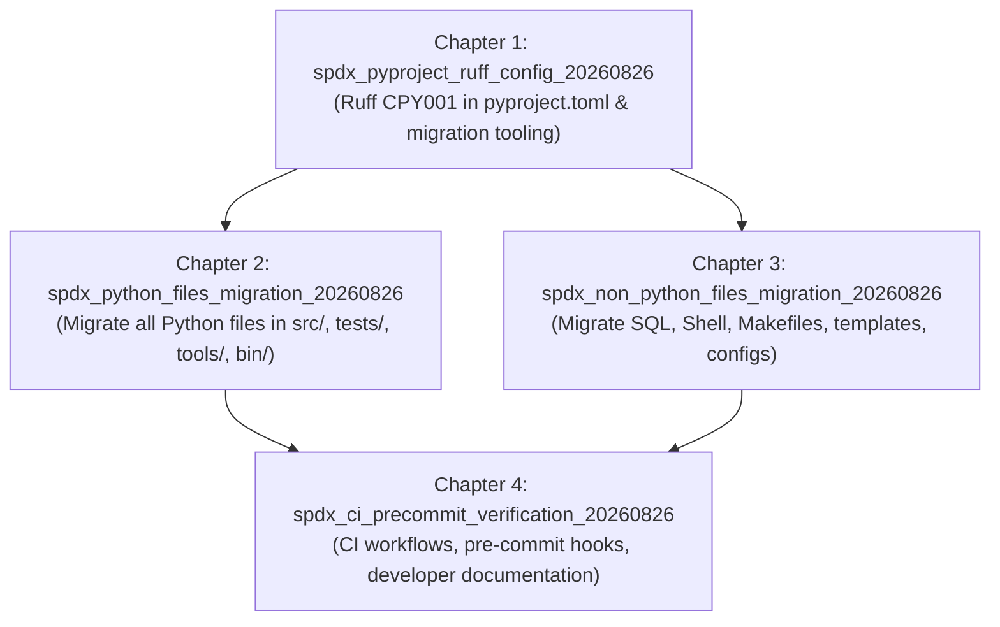

# Master PRD: SPDX Copyright & License Header Migration

**PRD ID:** `spdx_copyright_migration_20260826`

## Executive Summary & North Star Goal

The GOE (Gluent Offload Engine) framework currently uses a verbose 13-line Apache 2.0 license notice at the top of hundreds of source files. This legacy header adds visual noise, increases maintenance overhead, and is inconsistently formatted across non-Python files.

This PRD modernizes all source headers by standardizing on the concise, industry-standard 2-line **SPDX (Software Package Data Exchange)** format and configuring **Ruff's `CPY001` (`missing-copyright-notice`)** rule in `pyproject.toml` to automatically check and enforce header compliance in Python files on every CI run and developer commit.



---

## Standardized Header Formats

### 1. Python, Shell, Makefiles, Dockerfiles, INI/Conf, YAML (`#`)
```python
# SPDX-FileCopyrightText: <year> The GOE Authors
# SPDX-License-Identifier: Apache-2.0
```

### 2. SQL (`--`)
```sql
-- SPDX-FileCopyrightText: <year> The GOE Authors
-- SPDX-License-Identifier: Apache-2.0
```

### 3. C / C++ / CSS / JavaScript / Scala (`/* ... */` or `//`)
```javascript
/*
 * SPDX-FileCopyrightText: <year> The GOE Authors
 * SPDX-License-Identifier: Apache-2.0
 */
```

### 4. HTML / Jinja / XML (`<!-- ... -->`)
```html
<!--
SPDX-FileCopyrightText: <year> The GOE Authors
SPDX-License-Identifier: Apache-2.0
-->
```

*Note: The copyright `<year>` (e.g. `2016`, `2024`, or range `2016-2024`) will be extracted from each file's existing header to preserve historical copyright provenance.*

---

## Ruff CPY001 Validation & Mechanics

Ruff provides native copyright notice enforcement via the `CPY001` rule (derived from `flake8-copyright`):
1. **Rule Selection:** Add `"CPY"` to `[tool.ruff.lint.select]`.
2. **Regex Configuration:** Configure `[tool.ruff.lint.flake8-copyright]` with:
   ```toml
   [tool.ruff.lint.flake8-copyright]
   notice-rgx = "(?i)# SPDX-FileCopyrightText: [^\\r\\n]+\\r?\\n# SPDX-License-Identifier: Apache-2.0"
   min-file-size = 10
   ```
3. **Execution Scope:** Ruff checks the first 4096 bytes of all Python files in `src`, `tests`, `tools`, and root-level scripts. If a file does not match `notice-rgx`, `ruff check` exits with a lint error (`CPY001: Missing copyright notice at top of file`).

---

## Child Flows (Chapters)

### Chapter 1: Ruff CPY001 Configuration & Automated Migration Tooling
- **Flow ID:** `spdx_pyproject_ruff_config_20260826`
- **Scope:**
  - Configure `[tool.ruff.lint.flake8-copyright]` and `select = [..., "CPY"]` in `pyproject.toml`.
  - Author reusable Python utility `tools/migrate_spdx_headers.py` to parse existing headers across all file types, preserve copyright years, and rewrite them into SPDX format.
  - Implement unit test suite `tests/unit/test_migrate_spdx_headers.py` for migration tool verification.

### Chapter 2: Python Source Files SPDX Header Migration & Ruff Enforcement
- **Flow ID:** `spdx_python_files_migration_20260826`
- **Scope:**
  - Migrate all Python source files in `src/goe/` (~120 files).
  - Migrate all Python test files in `tests/` and developer tools in `tools/` and root files (`noxfile.py`).
  - Execute and verify `uv run ruff check --select CPY` across the entire Python codebase with zero warnings/errors.

### Chapter 3: Non-Python Repository Files SPDX Header Migration
- **Flow ID:** `spdx_non_python_files_migration_20260826`
- **Scope:**
  - Migrate all Oracle SQL scripts in `sql/oracle/` (~150 files).
  - Migrate all CLI shell wrappers and bash scripts in `bin/` and `tools/`.
  - Migrate Makefiles, configuration templates (`templates/conf/`), HTML/Jinja report templates (`templates/offload_status_report/`), and Dockerfiles (`docs/google_cloud_run/`).

### Chapter 4: CI Enforcement, Pre-commit Integration & Developer Documentation
- **Flow ID:** `spdx_ci_precommit_verification_20260826`
- **Scope:**
  - Integrate Ruff `CPY` checks into `.pre-commit-config.yaml` and `.github/workflows/ci.yaml`.
  - Update `AGENTS.md`, `README.md`, and project contributing docs to document the SPDX header standard.
  - Run full test and lint test suites (`make lint`, `make test-unit`) to guarantee zero regressions.

---

## Global Constraints & Guidelines
1. **Zero Logic Mutation**: No application logic, functions, classes, comments, or imports outside the file header comment block shall be altered.
2. **Provenance Preservation**: Historical copyright years (e.g. `2016`, `2024`) must be preserved in the `SPDX-FileCopyrightText` line.
3. **Strict Shebang Preservation**: Any executable scripts with `#!/usr/bin/env ...` must retain their shebang as line 1, placing the SPDX header immediately beneath.
4. **All Python Files Ruff-Compliant**: Every `.py` file must pass `ruff check --select CPY` cleanly.
