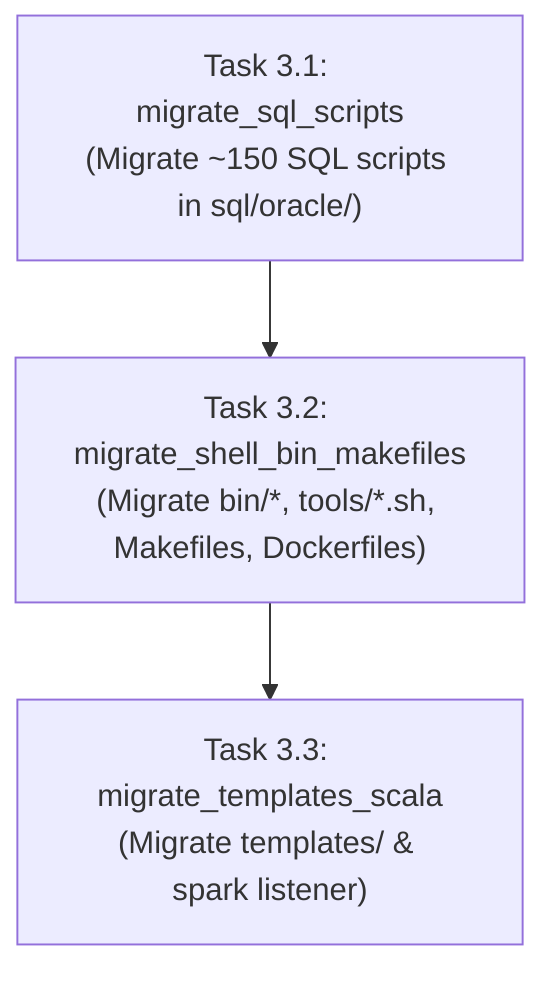

# Flow: Non-Python Repository Files SPDX Header Migration

**Flow ID:** `spdx_non_python_files_migration_20260826`  
**Parent PRD:** `spdx_copyright_migration_20260826` (Chapter 3)

## 1. Specification

### 1.1 Scope & Inventory
1. **SQL Files (`sql/oracle/` ~150 files)**: `-- SPDX-FileCopyrightText: ...` / `-- SPDX-License-Identifier: Apache-2.0`
2. **CLI Executables & Shell Scripts (`bin/`, `tools/`, `docs/google_cloud_run/`)**: `# SPDX-FileCopyrightText: ...` / `# SPDX-License-Identifier: Apache-2.0`
3. **Makefiles (`Makefile`, `target/Makefile`, `tools/transport/Makefile`, `tools/spark-listener/Makefile`, `templates/conf/Makefile`)**: `# SPDX-FileCopyrightText: ...` / `# SPDX-License-Identifier: Apache-2.0`
4. **Configuration & Report Templates (`templates/conf/`, `templates/offload_status_report/`, `templates/spark/`)**: Jinja (`<!-- ... -->`), HTML (`<!-- ... -->`), CSS (`/* ... */`), JS (`/* ... */`), XML (`<!-- ... -->`), Conf/Env (`#`).
5. **Scala Listener (`tools/spark-listener/src/main/scala/GOETaskListener.scala`, `build.sbt`)**: `/* ... */` and `#`.

---

## 2. Implementation Plan (Worksheet)

### Phase 1: Oracle SQL Scripts
- [x] `3.1`: Migrate all SQL scripts in `sql/oracle/source/` and `sql/oracle/tools/` to `--` SPDX headers.

### Phase 2: Shell Scripts, Binaries & Makefiles
- [x] `3.2`: Migrate `bin/*` wrapper scripts, `tools/*.sh`, Dockerfiles, and Makefiles to `#` SPDX headers with preserved shebangs.

### Phase 3: Templates & Spark Listener
- [x] `3.3`: Migrate `templates/` (HTML, Jinja, CSS, JS, conf, XML) and Scala files in `tools/spark-listener/`.

---

## 3. Continuity Snapshot
- **Active Flow:** `spdx_non_python_files_migration_20260826`
- **Current Task:** None (`null`)
- **Plan Revision:** 1
- **State Revision:** 3
- **Next Step:** Proceed to Chapter 4 (`spdx_ci_precommit_verification_20260826`).
