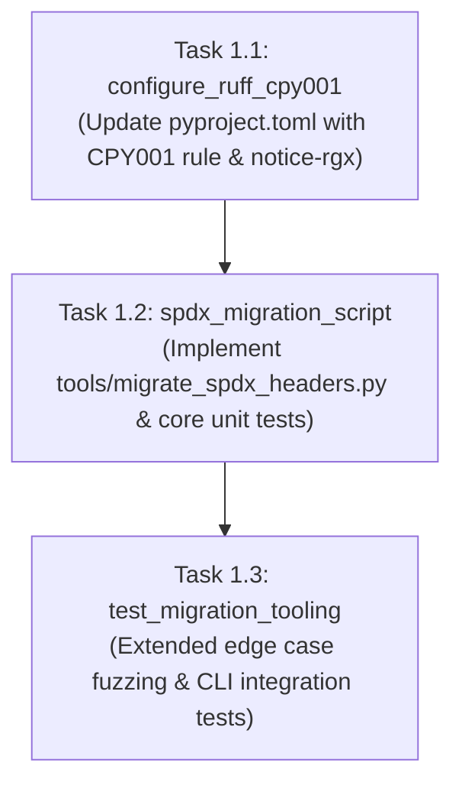

# Flow: Ruff CPY001 Configuration & Automated Migration Tooling

**Flow ID:** `spdx_pyproject_ruff_config_20260826`  
**Parent PRD:** `spdx_copyright_migration_20260826` (Chapter 1)

## 1. Specification

### 1.1 Context & Objectives
To standardize copyright and license headers across the repository and enforce them continuously, we must:
1. Configure Ruff's `CPY001` (`missing-copyright-notice`) rule in `pyproject.toml`.
2. Build an automated migration script (`tools/migrate_spdx_headers.py`) capable of parsing existing headers across all file formats, extracting the historical copyright year, and formatting the concise 2-line SPDX header.
3. Test the migration script thoroughly with unit tests in `tests/unit/test_migrate_spdx_headers.py`.

### 1.2 Target Header Formats
- **Python / Shell / Dockerfile / Make / YAML (`#`)**:
  ```python
  # SPDX-FileCopyrightText: <year> The GOE Authors
  # SPDX-License-Identifier: Apache-2.0
  ```
- **SQL (`--`)**:
  ```sql
  -- SPDX-FileCopyrightText: <year> The GOE Authors
  -- SPDX-License-Identifier: Apache-2.0
  ```
- **C-style / CSS / JS / Scala (`/* ... */`)**:
  ```javascript
  /*
   * SPDX-FileCopyrightText: <year> The GOE Authors
   * SPDX-License-Identifier: Apache-2.0
   */
  ```
- **HTML / Jinja / XML (`<!-- ... -->`)**:
  ```html
  <!--
  SPDX-FileCopyrightText: <year> The GOE Authors
  SPDX-License-Identifier: Apache-2.0
  -->
  ```

### 1.3 Ruff Configuration Specification
In `pyproject.toml`:
```toml
[tool.ruff.lint]
select = [
    "E",   # pycodestyle errors
    "F",   # pyflakes
    "W",   # pycodestyle warnings
    "I",   # isort
    "UP",  # pyupgrade
    "B",   # flake8-bugbear
    "RUF", # ruff-specific rules
    "CPY", # flake8-copyright
]

[tool.ruff.lint.flake8-copyright]
notice-rgx = "(?i)# SPDX-FileCopyrightText: [^\\r\\n]+\\r?\\n# SPDX-License-Identifier: Apache-2.0"
min-file-size = 10
```

---

## 2. Implementation Plan (Worksheet)



### Phase 1: Configuration & Migration Tooling
- [x] `1.1`: Update `pyproject.toml` with Ruff `CPY` in `lint.select` and `[tool.ruff.lint.flake8-copyright]` configuration.
- [x] `1.2`: Implement `tools/migrate_spdx_headers.py` and core test suite in `tests/unit/test_migrate_spdx_headers.py` (Red-Green TDD).
- [x] `1.3`: Add extended edge case test coverage in `tests/unit/test_migrate_spdx_headers.py` (shebangs, year ranges, dry-run CLI flags, non-standard whitespace, idempotency).

---

## 3. Continuity Snapshot
- **Active Flow:** `spdx_pyproject_ruff_config_20260826`
- **Current Task:** None (`null`)
- **Plan Revision:** 2
- **State Revision:** 3
- **Next Step:** Proceed to Chapter 2 (`spdx_python_files_migration_20260826`).

