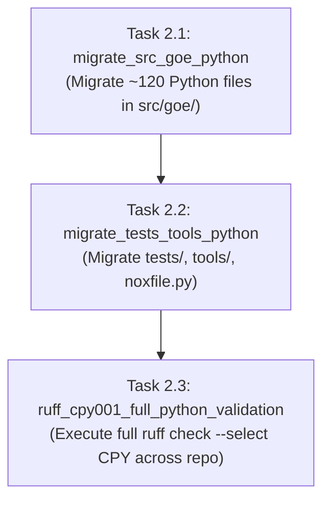

# Flow: Python Source Files SPDX Header Migration & Ruff Enforcement

**Flow ID:** `spdx_python_files_migration_20260826`  
**Parent PRD:** `spdx_copyright_migration_20260826` (Chapter 2)

## 1. Specification

### 1.1 Scope & Goals
This chapter executes the automated migration tool against all Python source files across the repository, replacing legacy 13-line Apache headers with the 2-line SPDX format and validating with Ruff `CPY001`:
```python
# SPDX-FileCopyrightText: <year> The GOE Authors
# SPDX-License-Identifier: Apache-2.0
```

### 1.2 Target Inventory
1. **Core Library (`src/goe/`)**: ~120 Python files across CLI, conductor, config, connect, data-types, filesystem, listener, offload, persistence, and util subpackages.
2. **Test Suites (`tests/`)**: ~50 Python test files across `tests/unit/`, `tests/integration/`, and `tests/testlib/`.
3. **Developer Tools & Scripts (`tools/`, root)**: `tools/caller.py`, `tools/redis_subscribe.py`, `tools/bundle_python.py`, `noxfile.py`.

---

## 2. Implementation Plan (Worksheet)



### Phase 1: Core Framework Source Migration
- [x] `2.1`: Run migration across `src/goe/` and verify with `uv run ruff check src/goe/ --select CPY`.

### Phase 2: Tests, Tools & Root Scripts Migration
- [x] `2.2`: Run migration across `tests/`, `tools/`, and `noxfile.py` and verify with `uv run ruff check tests/ tools/ noxfile.py --select CPY`.

### Phase 3: Comprehensive Python Lint Gate
- [x] `2.3`: Run `uv run ruff check . --select CPY` and `make lint` across the entire workspace to ensure 100% compliance and zero regressions.

---

## 3. Continuity Snapshot
- **Active Flow:** `spdx_python_files_migration_20260826`
- **Current Task:** None (`null`)
- **Plan Revision:** 1
- **State Revision:** 3
- **Next Step:** Proceed to Chapter 3 (`spdx_non_python_files_migration_20260826`).
