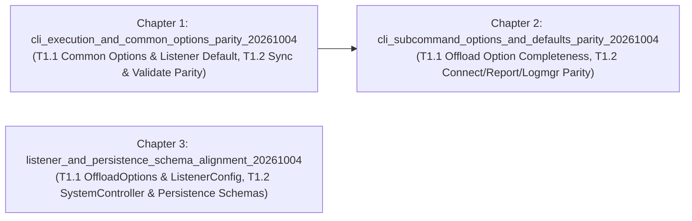

# Master PRD: GOE v2 `main` Baseline Alignment & Functional Parity Remediation (`v2_main_alignment_remediation_20261004`)

## 1. Executive Summary & Architectural Vision

Following the GOE v2 modernization overhaul—transitioning the codebase to Python 3.12+, `uv` + `hatchling`, `python-oracledb`, `msgspec` + `sqlspec`, `python-dotenv` 4-tier `offload.env` auto-discovery, unified `rich-click` CLI entrypoints, and an embedded Litestar 2.x + Granian + `litestar-queues` + `MemoryCache` Listener service—a primary-source alignment audit (`v2_main_alignment_audit`) compared the current working tree line-by-line against `main` (`ab4f0f9`), `origin/litestar` (`f2b9533`), `origin/msgspec` (`994a654`), and `origin/dotenv` (`6a5c5c3`).

While the core v2 architectural pillars are structurally sound, the audit identified specific functional regressions and contract mismatches introduced during the initial `rich-click` CLI wrapper creation and Litestar/msgspec schema translation:
1. **CLI Execution & Common Options Regressions**:
   - `goe sync` (`src/goe/cli/commands/sync.py:49-78`) crashes at runtime due to three API signature mismatches when invoking `OrchestrationConfig.from_dict`, `orchestration_repo_client_factory`, and `run_schema_sync`.
   - `goe validate` (`src/goe/cli/commands/validate.py:67-87`) skips `post_process_args(options)` (`src/goe/scripts/agg_validate.py:146-176`), leaving `-F/--filters`, `-S/--selects`, `-G/--group-bys`, and `-A/--aggregate-functions` unparsed, and discards the boolean return value of `run_agg_validate(options)` rather than exiting non-zero on validation failure.
   - Global CLI flags (`-v/--verbose`, `--vv/--vverbose`, `-q/--quiet`, `--no-ansi`, `--version`, and the 7 common/hidden options from `src/goe/goe.py:2705-2771`) are only attached to the root `goe` group, causing invocations through `bin/*` shims (`bin/offload -t SH.SALES -x -v`) or trailing flags (`goe offload -t SH.SALES -x -v`) to fail with `No such option`.
   - `bin/listener` inserts `"listener"` without `"start"`, causing `bin/listener` to print help text and exit 0 instead of starting the server as `main:bin/listener` did.
2. **CLI Subcommand Option Completeness & Default Parity**:
   - `goe offload` (`src/goe/cli/commands/offload.py`) omits 12 CLI options present in `src/goe/goe.py:2939-3105` and passes `--older-than-days` as `int` instead of `str` (causing `check_opt_is_posint` in `src/goe/offload/offload.py:345` to fail).
   - `goe connect` omits hidden `--create-backend-db`.
   - `goe report` overrides original `offload_status_report.py:71-72` defaults (`-o/--output-format` changed from `"text"` to `"HTML"`, `--output-level` changed from `"summary"` to `"detail"`), omits hidden `-d/--demo`, and omits `"ansi"` propagation.
   - `goe logmgr` ignores `LOG_MV_MINS` from the environment when `--min-age-minutes` is not explicitly passed on the CLI (`main:bin/logmgr:28`).
3. **Listener REST & Persistence Schema Contract Alignment**:
   - `OffloadOptions` (`src/goe/listener/schemas.py:156-189`) defines non-canonical field names (`target_table_name`, `partitions`, `subpartitions`, `bucket_hash_column`, `sort_columns`, `partition_functions`, etc.) that are not in `EXPECTED_CONFIG_ARGS` (`src/goe/config/orchestration_config.py:72-182`) or `OffloadOperation.from_dict`, causing `POST /api/orchestration/offload/` background jobs to fail in `OrchestrationConfig.from_dict(params)`.
   - `SystemController.get_table_partitions` (`src/goe/listener/controllers/system.py:87`) calls `p.get("partition_name")` on `subpartitions`, raising `AttributeError` when `OracleOrchestrationRepoClient.get_table_subpartitions()` returns `list[SubPartitionDetail]` (`msgspec.Struct`).
   - `ListenerConfig` (`src/goe/listener/schemas.py:40-50`) omits optional `offload_options`, `present_options`, and `prepare_options` fields, `ColumnDetail` (`src/goe/persistence/schemas.py:68-77`, `src/goe/listener/schemas.py:83-92`) omits `data_precision: int | None = None`, `SubPartitionDetail` omits `partition_name` and `partition_position`, and `src/goe/util/serialization.py` lacks the domain object fallback encoder hook from `src/goe/util/json_tools.py`.

This Master PRD decomposes the remediation into **3 focused Child Flows (Chapters)** and **6 decision-complete implementation tasks**, planned to full `/flow:refine` and `/flow:revise` Zero-Ambiguity Worksheet depth.

---

## 2. Promoted Research & Primary Sources

- [GOE v2 Modernization vs. Main Baseline Alignment Audit (`v2_main_alignment_audit`)](research/v2_main_alignment_audit/research.md)

---

## 3. Global Invariants & Constraints

1. **v2 Architecture Preservation**: All fixes must preserve the v2 modernized stack (`rich-click`, `msgspec.Struct`, `sqlspec`, `python-dotenv`, embedded Litestar 2.x + Granian + `litestar-queues` + `MemoryCache`/`MemorySyncCache`).
2. **Code Style & Docstring Discipline**:
   - Python >= 3.12 typing (`list`, `dict`, `X | None`).
   - All imports at module top-level (zero nested/function-scoped imports).
   - Zero inline `#` comments inside Python functions; all rationale belongs in PEP 257 docstrings.
   - Standard 2-line SPDX header (`# SPDX-FileCopyrightText: <year> The GOE Authors` and `# SPDX-License-Identifier: Apache-2.0`) at the top of every source and test file.
3. **Verification Strategy (`regression_tdd`)**: Every task worksheet enforces `regression_tdd`—first writing unit tests that reproduce the exact regression against `main`, confirming the initial test failure, implementing the fix, and verifying green unit tests, `ruff`, and `mypy`.

---

## 4. Child Flows (Chapters)

| Chapter | Flow ID | Title | Spec Path | State | Dependencies |
| :--- | :--- | :--- | :--- | :--- | :--- |
| **Chapter 1** | `cli_execution_and_common_options_parity_20261004` | CLI Execution & Common Options Parity | [spec.md](../cli_execution_and_common_options_parity_20261004/spec.md) | `completed` (`2/2` tasks closed) | `[]` |
| **Chapter 2** | `cli_subcommand_options_and_defaults_parity_20261004` | CLI Subcommand Option Completeness & Default Parity | [spec.md](../cli_subcommand_options_and_defaults_parity_20261004/spec.md) | `completed` (`2/2` tasks closed) | `["cli_execution_and_common_options_parity_20261004"]` |
| **Chapter 3** | `listener_and_persistence_schema_alignment_20261004` | Listener REST & Persistence Schema Alignment | [spec.md](../listener_and_persistence_schema_alignment_20261004/spec.md) | `completed` (`2/2` tasks closed) | `[]` |

---

## 5. Cross-Flow Dependency Graph & Execution Order

- **Chapter 1 (`cli_execution_and_common_options_parity_20261004`)** establishes `src/goe/cli/common.py` (`@common_options` and `extract_common_options`), fixes `bin/listener` default server startup, and repairs `goe sync` and `goe validate` runtime execution.
- **Chapter 2 (`cli_subcommand_options_and_defaults_parity_20261004`)** builds on `src/goe/cli/common.py` from Chapter 1 to apply `@common_options` across `offload`, `connect`, `report`, and `logmgr`, restores the 12 missing `offload` options and `--older-than-days` string type, and restores `connect`, `report`, and `logmgr` options/defaults.
- **Chapter 3 (`listener_and_persistence_schema_alignment_20261004`)** is independent of the CLI chapters and aligns Listener `OffloadOptions`, `ListenerConfig`, `SystemController.get_table_partitions`, persistence `ColumnDetail` / `SubPartitionDetail`, and `serialization.py`.

---

## 6. Master Requirement-to-Flow Traceability Matrix

| Audit Finding | Requirement Summary | Target Child Flow | Target Task | Verification Test File(s) |
| :--- | :--- | :--- | :--- | :--- |
| **CLI-3** | Support `-v/--verbose`, `--vv/--vverbose`, `-q/--quiet`, `--no-ansi`, `--version`, and 7 hidden common options on root `goe`, all subcommands, and `bin/*` wrappers | `cli_execution_and_common_options_parity_20261004` | `T1.1` | `tests/unit/cli/test_common_options.py` |
| **CLI-4** | `bin/listener` and `goe listener` (without subcommand) invoke `start` by default | `cli_execution_and_common_options_parity_20261004` | `T1.1` | `tests/unit/cli/test_listener_command.py` |
| **CLI-1** | `goe sync` fixes `OrchestrationConfig` / `orchestration_repo_client_factory` / `schema_sync` 4-arg invocation and exits with `return_code` | `cli_execution_and_common_options_parity_20261004` | `T1.2` | `tests/unit/cli/test_sync_command.py` |
| **CLI-2, CORE-1** | `goe validate` runs `post_process_args(options)`, exposes `--target-name` & `--dev-log-level`, types `--as-of-scn` as `int`, exits `0 if ret else 1`, and `agg_validate.py` calls `load_env()` before `check_config_path()` | `cli_execution_and_common_options_parity_20261004` | `T1.2` | `tests/unit/cli/test_validate_command.py` |
| **CLI-5a** | `goe offload` restores 12 missing CLI options, types `--older-than-days` as `str`, and registers visible options in `OPTION_GROUPS["goe offload"]` | `cli_subcommand_options_and_defaults_parity_20261004` | `T1.1` | `tests/unit/cli/test_offload_command.py` |
| **CLI-5b** | `goe connect` adds `--create-backend-db`; `goe report` restores `"text"` / `"summary"` defaults and `-d/--demo`; `goe logmgr` honors `LOG_MV_MINS` | `cli_subcommand_options_and_defaults_parity_20261004` | `T1.2` | `tests/unit/cli/test_connect_command.py`, `tests/unit/cli/test_report_command.py`, `tests/unit/cli/test_logmgr_command.py` |
| **LIS-1, LIS-3** | `OffloadOptions` aligns with `main` / `OrchestrationConfig` / `OffloadOperation` keys with alias normalization via `to_params_dict()`; `ListenerConfig` adds optional `offload_options`, `present_options`, `prepare_options` | `listener_and_persistence_schema_alignment_20261004` | `T1.1` | `tests/unit/listener/test_offload_options_schema.py` |
| **LIS-2, CORE-2, CORE-3** | `get_table_partitions` handles `SubPartitionDetail` structs; `ColumnDetail` adds `data_precision`; `SubPartitionDetail` adds `partition_name`/`partition_position`; `serialization.py` delegates to `json_tools` | `listener_and_persistence_schema_alignment_20261004` | `T1.2` | `tests/unit/listener/test_asgi.py`, `tests/unit/persistence/test_schemas.py`, `tests/unit/util/test_json_tools.py` |
