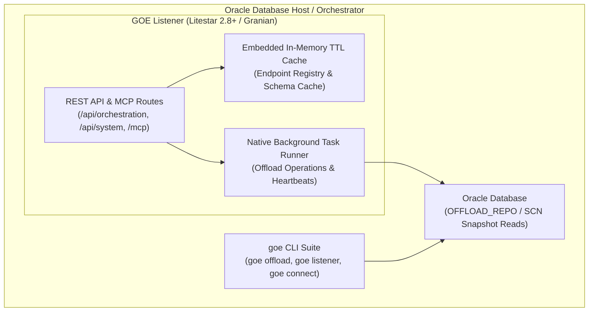

# GOE Embedded Listener & Task Execution Architecture

**Status:** Proposed  
**Author:** AI Pair Programmer & Cody Fincher  
**Date:** 2026-08-26  
**Target Subsystems:** `src/goe/listener/`, `src/goe/util/`, `bin/`, `templates/conf/`

---

## 1. Executive Summary

This specification establishes a **self-contained, zero-external-dependency** architecture for the GOE Listener service and asynchronous task execution, tailored specifically for Oracle Database deployments.

Key Architectural Decisions:
1. **Elimination of External Key-Value Brokers**: Remove dependencies on Redis, Valkey, `redis-py`, and generic queue brokers (`litestar-queues`).
2. **Oracle Server Co-Location**: GOE binaries run directly on or adjacent to the Oracle database server, using Oracle RDBMS (`OFFLOAD_REPO`) as the single source of truth.
3. **Embedded In-Memory TTL Cache**: In-process asynchronous cache with TTL expiration for listener endpoint registration, periodic heartbeats, and query metadata caching.
4. **Native Asynchronous Task Execution**: Lightweight background task dispatching via Litestar's native `BackgroundTask` and embedded async worker pool.
5. **Deprecation Strategy & Shims**: Add explicit `DeprecationWarning` shims for legacy Redis modules and `bin/` wrapper scripts scheduled for removal in GOE 2.0.0.

---

## 2. Context & Domain Realities

### 2.1 Oracle Host Co-Location
- GOE is an enterprise offload engine purpose-built for Oracle databases.
- The software runs directly on the Oracle database server or a dedicated compute orchestrator with direct access to Oracle (`OFFLOAD_REPO` repository schema).
- There is no PostgreSQL, external message queue, or standalone caching cluster in typical customer environments.

### 2.2 Re-evaluating Listener & Redis Usage
Historically, the listener service specified Redis for two functions:
1. **Heartbeat & Endpoint Registration**: Multi-instance peer discovery with a 60-second TTL.
2. **Introspection Caching**: Caching schema and table metadata.

In real-world deployments, Redis was rarely deployed, creating unnecessary operational friction. For GOE's use cases, an embedded in-memory cache with standard ~10-30 second polling and Oracle repository tracking provides identical functionality with zero external operational overhead.

---

## 3. Self-Contained Architecture



### 3.1 Embedded In-Memory TTL Cache
`src/goe/listener/utils/cache.py` implements a thread-safe, asynchronous in-memory key-value cache (`MemoryCache`):
- Keys stored with epoch expiration timestamps.
- Native asynchronous `get`, `set(key, value, ttl=...)`, `delete`, `keys`, `scan`, and `ping` methods.
- Automatically purges expired keys during access passes.
- Replaces external Redis daemons with zero network latency and zero memory overhead.

### 3.2 Native Background Task Dispatching
Asynchronous offload execution is handled natively by Litestar:
- `OrchestrationController.execute_offload_command` validates locks via `OrchestrationLockInterface` and returns `CommandScheduled(execution_id=..., status="QUEUED")`.
- Dispatches execution asynchronously using Litestar's `BackgroundTask(run_offload_job, params=params, execution_id=...)` or an in-process worker task group.
- Eliminates external queue broker packages (`litestar-queues`, `celery`, `saq`).

---

## 4. Deprecation Shims & Removal Roadmap

To ensure backwards compatibility while transitioning the codebase, explicit deprecation shims are established:

### 4.1 Legacy Redis Modules
- **`src/goe/util/redis_tools.py`**:
  ```python
  import warnings
  warnings.warn(
      "goe.util.redis_tools is deprecated and will be removed in GOE 2.0.0. "
      "Use embedded in-memory cache or Oracle repository persistence instead.",
      DeprecationWarning,
      stacklevel=2,
  )
  ```
- **`src/goe/listener/utils/cache.py`**:
  `RedisClient` alias pointing to `MemoryCache` with `DeprecationWarning`.

### 4.2 Legacy Shell Wrapper Scripts in `bin/`
All standalone entry points in `bin/` (`bin/offload`, `bin/connect`, `bin/listener`, `bin/logmgr`, `bin/agg_validate`) are preserved as lightweight wrappers calling `goe <subcommand>` with a deprecation notice:
```bash
# Deprecated: Will be removed in GOE 2.0.0. Use 'goe offload' instead.
```

---

## 5. Dependency Cleanup in `pyproject.toml`

The listener dependencies in `pyproject.toml` are streamlined:

```toml
# GOE Listener packages (Lean, zero external broker)
brotli = ">=1.0.9"
tenacity = ">=8.0.1"
uvloop = "*"
httptools = "*"
litestar = ">=2.8.0"
litestar-granian = ">=0.4.0"
litestar-security = ">=0.1.0"
litestar-autowire = ">=0.1.0"
litestar-mcp = ">=0.1.0"
```
*(Removed: `redis`, `valkey`, `hiredis`, `libvalkey`, and `litestar-queues`)*

---

## 6. Verification Plan

1. **Unit Tests**: Full unit test coverage of `MemoryCache`, `OrchestrationController`, `SystemController`, `jobs.py`, and `test_mcp.py` with zero external services required.
2. **Deprecation Warnings**: Verification that accessing legacy shims emits proper `DeprecationWarning`s.
3. **Execution Gate**: `export GOOGLE_API_USE_CLIENT_CERTIFICATE=false && uv run pytest tests/unit`.
