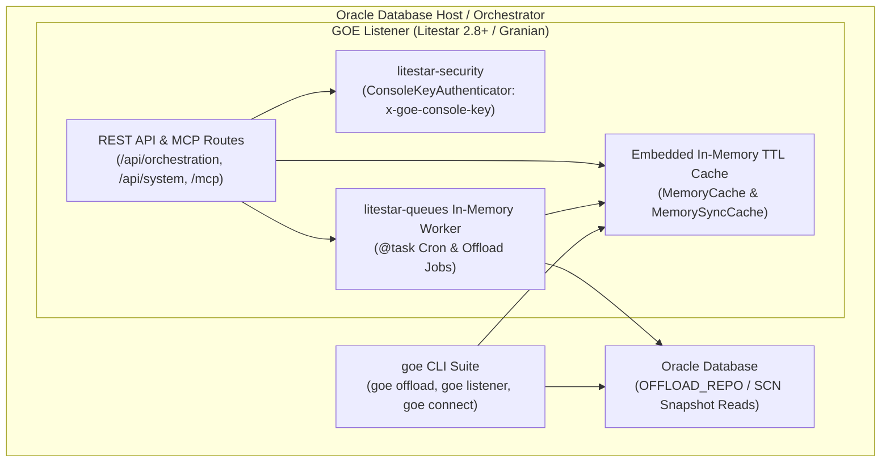

# GOE Embedded Listener & Task Execution Architecture

**Status:** Implemented  
**Author:** AI Pair Programmer & Cody Fincher  
**Date:** 2026-10-02  
**Target Subsystems:** `src/goe/listener/`, `src/goe/util/`, `bin/`, `templates/conf/`

---

## 1. Executive Summary

This specification establishes a **self-contained, zero-external-broker** architecture for the GOE Listener service and asynchronous task execution, tailored specifically for Oracle Database deployments.

Key Architectural Decisions:
1. **Elimination of External Key-Value Brokers**: Remove dependencies on Redis, Valkey, `redis-py`, `hiredis`, and `libvalkey`.
2. **Oracle Server Co-Location**: GOE binaries run directly on or adjacent to the Oracle database server, using Oracle RDBMS (`OFFLOAD_REPO`) as the single source of truth.
3. **Embedded In-Memory TTL Cache**: In-process thread-safe asynchronous (`MemoryCache`) and synchronous (`MemorySyncCache`) caches sharing a common backing store with TTL expiration for listener endpoint registration, periodic heartbeats, log buffering, and query metadata caching.
4. **First-Party `litestar-queues` & `litestar-security`**: Background task dispatching and cron scheduling via `litestar-queues` (`QueueConfig(queue_backend="memory", worker=WorkerConfig(placement="asgi"))`) wired through `AutowireConfig(domain_packages=["goe.listener"], integrations=["queues"])`, and constant-time `x-goe-console-key` header verification via `litestar-security` (`ConsoleKeyAuthenticator`).
5. **Deprecation Strategy & Shims**: Explicit `DeprecationWarning` shims for legacy Redis modules (`goe.util.redis_tools`, `goe.listener.utils.cache.RedisClient`) and `bin/` wrapper scripts scheduled for removal in GOE 2.0.0.

---

## 2. Context & Domain Realities

### 2.1 Oracle Host Co-Location
- GOE is an enterprise offload engine purpose-built for Oracle databases.
- The software runs directly on the Oracle database server or a dedicated compute orchestrator with direct access to Oracle (`OFFLOAD_REPO` repository schema).
- Requiring a standalone Redis/Valkey cluster in customer environments adds operational friction without durability benefits over Oracle RDBMS (`OFFLOAD_REPO`).

### 2.2 Re-evaluating Listener & Redis Usage
Historically, the listener service used Redis for:
1. **Heartbeat & Endpoint Registration**: Multi-instance peer discovery with a 60-second TTL.
2. **Introspection & Log Caching**: Caching schema/table metadata and active step logs.

An embedded in-memory cache (`MemoryCache` / `MemorySyncCache`) paired with Oracle repository tracking provides identical functionality with zero external daemon overhead.

---

## 3. Self-Contained Architecture


```mermaid
flowchart TD
    subgraph Oracle Host ["Oracle Database Host / Orchestrator"]
        CLI["goe CLI Suite\n(goe offload, goe listener, goe connect)"]
        
        subgraph Listener ["GOE Listener (Litestar 2.8+ / Granian)"]
            API["REST API & MCP Routes\n(/api/orchestration, /api/system, /mcp)"]
            Sec["litestar-security\n(ConsoleKeyAuthenticator: x-goe-console-key)"]
            MemCache["Embedded In-Memory TTL Cache\n(MemoryCache & MemorySyncCache)"]
            TaskRunner["litestar-queues In-Memory Worker\n(@task Cron & Offload Jobs)"]
        end

        Repo["Oracle Database\n(OFFLOAD_REPO / SCN Snapshot Reads)"]
    end

    API --> Sec
    API --> MemCache
    API --> TaskRunner
    TaskRunner --> MemCache
    TaskRunner --> Repo
    CLI --> MemCache
    CLI --> Repo
```

### 3.1 Embedded In-Memory TTL Cache
`src/goe/listener/utils/cache.py` implements thread-safe `MemoryCache` (async) and `MemorySyncCache` (sync) singletons sharing a single `RLock`-protected store:
- Keys stored with epoch expiration timestamps.
- Supports `get`, `set(key, value, ttl=...)`, `mget`, `delete`, `delete_keys`, `keys`, `scan`, `exists`, `expire`, `rpush`, `lrange`, and `ping`.
- Automatically prunes expired keys during access passes.

### 3.2 First-Party `litestar-queues` & `litestar-security`
- `OrchestrationController.execute_offload_command` dispatches `run_offload_job` onto `QueueService` (`queue_backend="memory"`, `WorkerConfig(placement="asgi")`) and returns `CommandScheduled`.
- Periodic `@task` jobs in `src/goe/listener/jobs.py` (`system.heartbeat`, `system.sync_schemas`, `system.sync_executions`) invoke `periodic_tasks` functions to populate `MemoryCache`.
- `src/goe/listener/security.py` configures `SecurityPlugin` with `ConsoleKeyAuthenticator`, enforcing `x-goe-console-key` via `secrets.compare_digest` when `OFFLOAD_LISTENER_SHARED_TOKEN` (`settings.shared_token`) is set and allowing local unauthenticated access when unset.

---

## 4. Deprecation Shims & Removal Roadmap

### 4.1 Legacy Redis Modules
- **`src/goe/util/redis_tools.py`**: Emits `DeprecationWarning` on import and delegates `RedisClient` to `MemorySyncCache`.
- **`src/goe/listener/utils/cache.py`**: Module `__getattr__("RedisClient")` emits `DeprecationWarning` and returns `MemoryCache`.

### 4.2 Legacy Wrapper Scripts in `bin/`
All standalone entry points in `bin/` (`bin/offload`, `bin/connect`, `bin/listener`, `bin/logmgr`, `bin/agg_validate`, `bin/offload_status_report`, `bin/schema_sync`) emit `DeprecationWarning` stating they will be removed in GOE 2.0.0 and delegate to `goe <subcommand>`.

---

## 5. Listener Dependencies in `pyproject.toml`

```toml
# GOE Listener packages
"brotli>=1.0.9",
"tenacity>=8.0.1",
"uvloop",
"httptools",
"litestar>=2.8.0",
"litestar-granian>=0.4.0",
"litestar-security>=0.1.0",
"litestar-autowire>=0.1.0",
"litestar-mcp>=0.1.0",
"litestar-queues>=0.1.0",
```

---

## 6. Verification

1. **Unit Tests**: Full unit test coverage of `MemoryCache` / `MemorySyncCache` (`test_cache.py`), `OrchestrationController` (`test_orchestration_controllers.py`), `SystemController` (`test_system_controllers.py`), `jobs.py` (`test_jobs.py`), `test_mcp.py`, `test_asgi.py`, and `test_deprecation_shims.py`.
2. **Execution Gate**: `export GOOGLE_API_USE_CLIENT_CERTIFICATE=false && uv run pytest tests/unit`.
